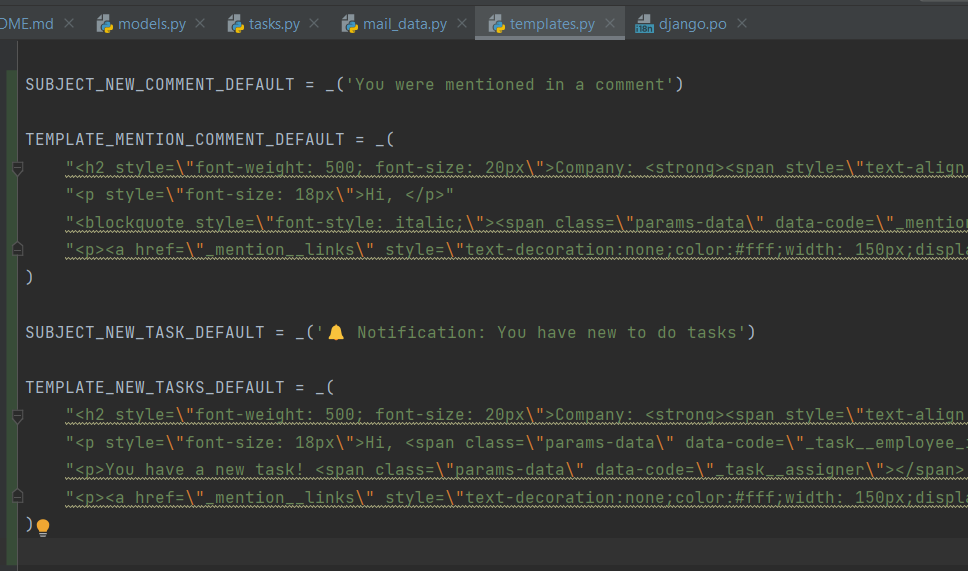
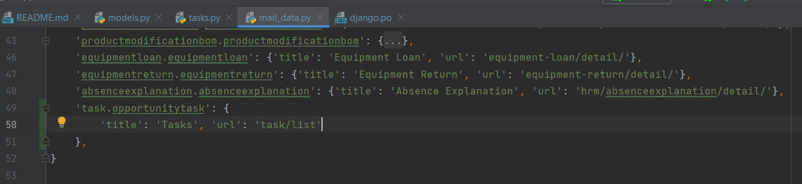
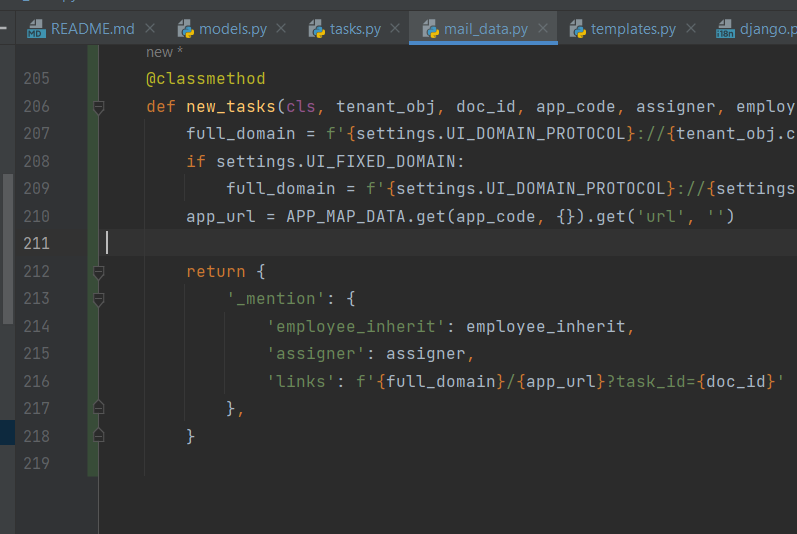
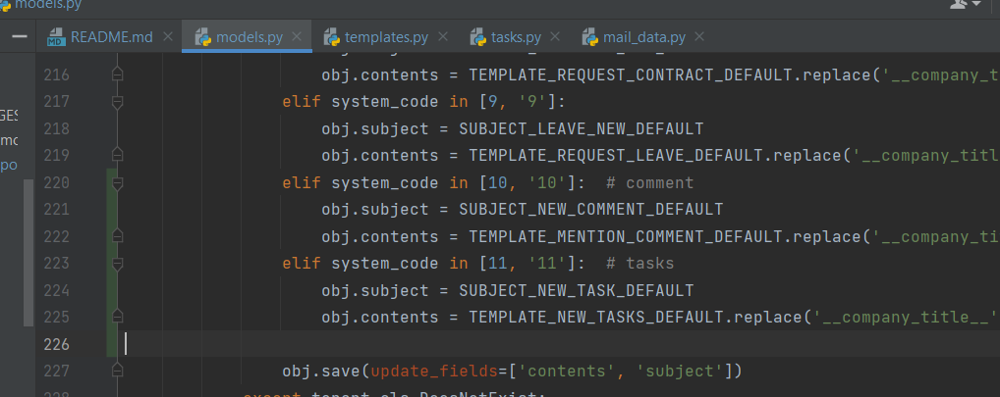
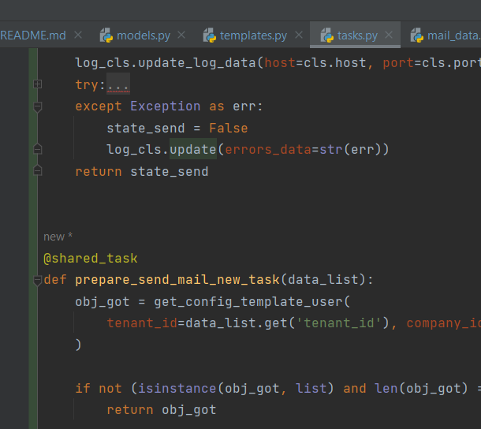

# Management Information System API (MIS API)

---

### Platform:

- Python 3.11 LTS
- Django (Django==4.1.3)
- Django Rest Framework (djangorestframework==3.14.0) (viết tắt là DRF)
- JSON Web Token (djangorestframework-simplejwt==5.2.2)
- ...

---


### Docker Desktop for Windows
1. Hướng dẫn: https://docs.docker.com/desktop/install/windows-install/
2. Download: https://desktop.docker.com/win/main/amd64/Docker%20Desktop%20Installer.exe
3. Sau khi cài đặt xong. Cài đặt compose: https://docs.docker.com/compose/install/#scenario-two-install-the-compose-plugin


### Cấu hình môi trường Dev
1. Python: 3.11
```text
Cài đặt python vào môi trường local của dev
Link download: 
- WinOS: https://www.python.org/ftp/python/3.11.2/python-3.11.2-amd64.exe
- MacOS: https://www.python.org/ftp/python/3.11.2/python-3.11.2-macos11.pkg
```
2. MySQL: 8.0
```text
Có 2 cách sử dụng:
1. [RECOMMEND] Sử dụng docker-compose tại {source}/builder/dev/ 
    - Cài đặt: 
        $ docker-compose up --build     # chạy command này tại thư mục {source}/builder/dev/ 
    
    - Thông tin server:
        NAME HOST DNS: 'db'
        HOST: '127.0.0.1'
        PORT: '3307'
        MYSQL_ROOT_PASSWORD: my_secret_password
        MYSQL_DATABASE: my_db
        MYSQL_USER: my_user
        MYSQL_PASSWORD: my_password
        + Dữ liệu của container này lưu tại: /c/DockerStorage/MySQLData/
        - Để truy cập vào mysql: Sử dụng hedies truy cập với (HOST, PORT, USER, PASSWORD) tương ứng (127.0.0.1, 3307, root, my_secret_password)
    
    Traceback:
        - Nếu đã chạy docker-compose build mà khởi động lại máy không kết nối source tới DB thì:
            B1: Khởi động docker
            B2: Mở git bash và thực hiện command "docker start db"
            B3: Sau đó chạy lại source 
        - Xóa thư mục chứa source SQL lỗi xóa bằng GUI Windows:
            B1: Mở git bash tại thư mục chứa source
            B2: Sử dụng lệnh rm -rf {tên folder cần xóa}
            
2. Cài đặt MySQL Server dưới local dev. 
    - Yêu cầu: MySQL 8.x
    - Tham khảo tại: https://dev.mysql.com/downloads/mysql/
    - Download tại: https://downloads.mysql.com/archives/get/p/23/file/mysql-8.0.31-winx64.zip
```
3. Rabbit: 3.9.28
```text
Có 2 cách sử dụng:
1. [RECOMMEND] Sử dụng docker-compose tại {source}/builder/dev/ 
    - Cài đặt: Nếu đã thực hiện cài đặt MySQL docker ở bước truớc thì không cần thực hiện. 
        $ docker-compose up --build     # chạy command này tại thư mục {source}/builder/dev/ 
    
    - Thông tin:
        NAME HOST DNS: 'queue'
        HOST: '127.0.0.1'
        PORT: '15673' (15672: port sử dụng để quản lý rabbit <-- không cần thiết sử dụng)
        USER: 'rabbitmq_user'
        PASSWORD: 'rabbitmq_passwd'
        
    Traceback:
        - Nếu đã chạy docker-compose build mà khởi động lại máy không kết nối source tới DB thì:
            B1: Khởi động docker
            B2: Mở git bash và thực hiện command "docker start queue"
            B3: Sau đó chạy lại source 
            
2. Cài đặt Rabbit Server dưới local dev:
    - Yêu cầu: RabbitMQ 3.9
    - Tham khảo và Download tại: https://www.rabbitmq.com/install-windows.html
```
4. Thêm các cấu hình vào local_settings để sử dụng. Copy đoạn dưới bỏ vào misapi/local_settings.py
```python
# Bật trạng thái debug khi run server source
DEBUG = True

# Bật trang API Docs
SHOW_API_DOCS = True
```
5. 

### Khởi động source code
1. Khởi chạy celery nhận và thực hiện task
```text
a. Không sử dụng và thực thi task real-time --> thay đổi cấu hình settings: CELERY_TASK_ALWAYS_EAGER = True # changed
b. Sử dụng queue:
    B1: Mở terminal (với shell path là git bash)
    B2: command: celery -A misapi worker --loglevel=INFO
        Windows: celery -A misapi worker --loglevel=INFO --pool=solo
    B3: Muốn dừng phải dùng ctrl + C (task không tự động load lại khi sửa đổi)
```   
2. Khởi chạy source code:
```text
a. Sử dụng run của pycharm + cấu hình interpreter sử dụng python local dev.
b. Sử dụng command: python manage.py runserver 8000
```
3. Vào Task Manager -> tab Startup -> Enable Docker: Để docker tự khởi động khi mở máy.
4. 


---

### Tuân thủ các quy tắc:

- RESTful API
- Authenticate với JWT (Access Token và Refresh Token)
- Coding Convention - Quy tắc code tuân thủ PEP8 và sử dụng Pylint để check.
- Mọi application đều đưa vào folder apps. Folder dùng chung mọi app là "shared"
- Sử dụng các hàm dùng chung phải thêm vào __init__ của shared - KHÔNG ĐƯỢC SỬ DỤNG IMPORT FILE CON CỦA SHARED
- VD dùng đúng: from apps.shared import mask_view ✔
- VD dùng sai: ~~from apps.shared.decorator import maskview~~

---

### Models: MySQL + ORM Django (Object Relational Mapping)

1. **Thiết kế DB luôn phải được LEADER review và duyệt trước khi được apply vào sử dụng**
2. Thiết kế models cho chức năng phải theo nguyên tắc tối ưu truy vấn và ràng buộc dữ liệu tốt
3. Luôn sử dụng UUID4 cho ID của từng bảng
4. Kế thừa từ các lớp model abstract trong apps.shared.models: MasterDataAbstractModel
5. *deleted* BaseModel: sử dụng cho các models dùng chung không có filter mặc định theo tenant như user, plan, country,...
6. TenantModel: Sử dụng cho các models dùng trong hệ thống ngoài thư mục apps/core có chứa filter mặc định tenant và
   mode
7. *deleted* TenantCoreModel: Sử dụng cho các models nằm trong thư mục core, có chứa filter mặc định theo tenant
8. M2MModel: Sử dụng cho các models Many To Many.
9. Trong từng models được kế thừa từ shared.models sẽ có các manager truy vấn dữ liệu khác nhau: objects, object_normal,
   object_global, object_private, object_team tùy theo từng yêu cầu mà sử dụng

Lưu ý: Các model có thể kế thừa từ các model abstract khác nhau:

1/ DataAbstractModel: Có các field tenant, company, inherit,... + các field thông tin cơ bản + các field sử dụng cho workflow
(thường được dùng cho model chính của chức năng)

2/ MasterDataAbstractModel: Có các field tenant, company,... + các field thông tin cơ bản
(thường được dùng cho model của master data hoặc model quan hệ 1-n với model chính)

3/ BastionFieldAbstractModel: Có các field opportunity, project
(thường được dùng cho model chính của chức năng có phân quyền opportunity/ project)

4/ SimpleAbstractModel: Có các field thông tin cơ bản
(thường được dùng cho model quan hệ n-n với model chính)

5/ M2MFilesAbstractModel: Có các field dùng cho attachment
(thường được dùng cho model quan hệ n-n giữa model chính và attachment)

VD:

```python
class Quotation(DataAbstractModel):  # main model
    purchase_requests = models.ManyToManyField(
        'purchasing.PurchaseRequest',
        through="QuotationPurchaseRequest",
        symmetrical=False,
        blank=True,
        related_name='quotation_map_purchase_request'
    )
	attachment_m2m = models.ManyToManyField(
        'attachments.Files',
        through='QuotationAttachment',
        symmetrical=False,
        blank=True,
        related_name='file_of_quotation',
    ) => lấy các records attachments.Files thông qua bảng *-* QuotationAttachment

	def save():
       ...

- Quan hệ 1-1, 1-*
class QuotationProduct(MasterDataAbstractModel):  # sub model
	quotation = models.ForeignKey(
        'quotation.Quotation',
        on_delete=models.CASCADE,
        verbose_name="quotation",
        related_name="quotation_product_quotation",
    	)

	def create(self, data):

	def save():

- Quan hệ *-*:
class QuotationPurchaseRequest(SimpleAbstractModel):
    quotation = models.ForeignKey(
        'quotation.Quotation',
        on_delete=models.CASCADE,
        verbose_name="quotation",
        related_name="quotation_pr_quotation",
    	)
    purchase_request = models.ForeignKey(
        'purchasing.PurchaseRequest',
        on_delete=models.CASCADE,
        verbose_name="purchase request",
        related_name="quotation_pr_pr",
    )

    class Meta:
        verbose_name = 'Quotation Purchase Request'
        verbose_name_plural = 'Quotation Purchase Requests'
        ordering = ()
        default_permissions = ()
        permissions = ()

class QuotationAttachment(M2MFilesAbstractModel):
	quotation = models.ForeignKey(
        'quotation.Quotation',
        on_delete=models.CASCADE,
        verbose_name="quotation",
        related_name="quotation_attachment_quotation",
    	)
	attachment = models.ForeignKey(
        'attachments.Files',
        on_delete=models.CASCADE,
        verbose_name="attachment",
        related_name="quotation_attachment_attachment",
    	)
 ```

- Query thuận: quotation_product = QuotationProduct.objects.filter(quotation=quotation_obj)
- Query ngược: quotation_product = quotation_obj.quotation_product_quotation.all()

---

### URLs: Tuân thủ quy tắc RESTful về đường dẫn điều hướng.

Mẫu: METHOD {path} (METHOD: GET, POST, PUT, DELETE | path: đường dẫn đến view)

1. Tên path luôn luôn phải trùng với tên class view mà nó sử dụng.
2. GET api/users : dùng để lấy dữ liệu về danh sách
2. POST api/users : dùng để tạo một dữ liệu mới
3. GET api/user/1 : dùng để lấy dữ liệu chi tiết theo ID - ở đây ID là 1
4. PUT api/user/1 : dùng để cập nhật dữ liệu cho 1 dữ liệu đã tạo trước đó - ở đây ID là 1
5. DELETE api/user/1 : dùng để xóa một dữ liệu đã có trong kho dữ liệu theo ID - ở đây ID là 1

```python
from django.urls import path

from apps.core.hr.views.employee import EmployeeList, EmployeeDetail

urlpatterns = [
    path('employees', EmployeeList.as_view(), name='EmployeeList'),  # GET, POST
    path("employee/<str:pk>", EmployeeDetail.as_view(), name="EmployeeDetail"),  # GET, PUT, DELETE
]
```

---

### Views: Sử dụng class view kế thừa từ mixins - sử dụng hàm của class là tên method (get, post, put, delete)

1. Sử dụng khung class view của DRF: Kế thừa từ BaseListMixin, BaseCreateMixin, BaseRetrieveMixin, BaseUpdateMixin,
   BaseDestroyMixin --> cos thể extends từ các class này để custom thêm
2. Sử dụng @swagger_auto_schema trên hàm của class view để tự động generate API Docs

```python
from rest_framework import generics
from drf_yasg.utils import swagger_auto_schema

from apps.core.hr.mixins import HRListMixin, HRCreateMixin, HRUpdateMixin, HRRetrieveMixin
from apps.core.hr.models import Employee
from apps.core.hr.serializers.employee_serializers import (
    EmployeeListSerializer, EmployeeCreateSerializer,
    EmployeeDetailSerializer, EmployeeUpdateSerializer
)

from apps.core.company.models import Company
from apps.core.company.serializers import CompanyCreateSerializer, CompanyListSerializer
from apps.shared import mask_view, BaseListMixin, BaseCreateMixin


class CompanyList(BaseListMixin, BaseCreateMixin):  # Kế thừa (extend) từ lớp mixin cơ bản
    """
    Company List:
        GET: List
        POST: Create a new
    """
    queryset = Company.objects.all()  # required | query hỗ trợ truy vấn dữ liệu
    serializer_list = CompanyListSerializer  # required | serializer hỗ trợ phân tích dữ liệu GET danh sách
    serializer_create = CompanyCreateSerializer  # required | serializer hỗ trợ tạo dữ liệu POST tạo
    serializer_detail = CompanyListSerializer  # required | serializer hỗ trợ phân tích dữ liệu sau khi tạo thành công
    list_hidden_field = [
        'tenant_id']  # default [] | hỗ trợ filter mặc định các trường trong danh sách (xem thêm ở class mixin)
    create_hidden_field = [
        'tenant_id']  # default [] | hỗ trợ thêm vào hàm serializer.save(**{data_extras}) để lưu xuống DB 

    @swagger_auto_schema(
        operation_summary="Company list",
        operation_description="Company list",
    )
    @mask_view(login_require=True, auth_require=False)  # hỗ trợ kiểm tra trung gian trước khi vào view
    def get(self, request, *args, **kwargs):
        return self.list(request, *args, **kwargs)

    @swagger_auto_schema(
        operation_summary="Create Company",
        operation_description="Create new Company",
        request_body=CompanyCreateSerializer,
    )
    @mask_view(login_require=True, auth_require=False)
    def post(self, request, *args, **kwargs):
        return self.create(request, *args, **kwargs)


# @mask_view(login_require=True, auth_require=False)
# 1. login_require: Yêu cầu đã đăng nhập (token còn hạn sử dụng - định danh người dùng) --> Đảm bảo lúc chạy view request.user là đã xác thực
# 2. auth_require: Yêu cầu kiểm tra quyền trước khi vào view (bắt buộc login_require = True khi dùng option này)
# 3. code_perm: mã để kiểm tra quyền ==> Đang được phát triển


class EmployeeDetail(
    HRRetrieveMixin,
    HRUpdateMixin,
    generics.GenericAPIView
):
    queryset = Employee.objects.select_related(
        "user",
    )
    serializer_detail = EmployeeDetailSerializer
    serializer_update = EmployeeUpdateSerializer

    @swagger_auto_schema(
        operation_summary="Employee detail",
        operation_description="Get employee detail by ID",
    )
    def get(self, request, *args, **kwargs):
        return self.retrieve(request, *args, **kwargs)

    @swagger_auto_schema(
        operation_summary="Update employee",
        operation_description="Update employee information by ID",
        request_body=EmployeeUpdateSerializer,
    )
    def put(self, request, *args, **kwargs):
        return self.update(request, *args, **kwargs)
```

---

### Các cách để sử dụng raise Exception trong Python (phương thức raise sẽ dừng process đang thực thi để trả về một lỗi)

1. Đăng nhập hết hạn

```python
from rest_framework.exceptions import PermissionDenied

raise PermissionDenied
```

2. Không có quyền truy cập

```python
from rest_framework.exceptions import AuthenticationFailed

raise AuthenticationFailed
```

3.

---

Đề nghị tuân thủ nghiêm ngặt các quy định - mọi quy định nằm ngoài rules phải được thoải thuận với team dev để đưa ra
hướng giải quyết và được ghi chú ở đay!

---

### Using environment trong môi trường sản xuất sản phẩm cho khách hàng.

1. Database:

```properties
DB_NAME='my_db'
DB_USER='my-user'
DB_PASSWORD='my-password'
DB_HOST='127.0.0.1'
DB_PORT='3306'
```

```python
# ==> USING FOR PRODUCTION WHEN SET ENVIRONMENT VARIABLE (sensitive information) <===
import os

DATABASES = {
    'default': {
        'ENGINE': 'django.db.backends.mysql',
        'NAME': os.environ.get('DB_NAME'), 'USER': os.environ.get('DB_USER'),
        'PASSWORD': os.environ.get('DB_PASSWORD'),
        'HOST': os.environ.get('DB_HOST'),
        'PORT': os.environ.get('DB_PORT'),
    }
}
```

2. Celery:

```python
# .env
MSG_QUEUE_HOST=host_name
MSG_QUEUE_PORT=sv_port
MSG_QUEUE_API_PORT=sv_api_port
MSG_QUEUE_USER=user
MSG_QUEUE_PASSWORD=passwd
MSG_QUEUE_BROKER_VHOST=vhost
```

3. Cache

```properties
CACHE_HOST='127.0.0.1'
CACHE_PORT='11211'
CACHE_OPTION='{"no_delay": true, "ignore_exc": true, "max_pool_size": 4, "use_pooling": true}'
```

```python
import os
import json

CACHE_HOST = os.environ.get("MSG_QUEUE_HOST")
CACHE_PORT = os.environ.get("MSG_QUEUE_PORT")
CACHE_OPTION = os.environ.get("CACHE_OPTION")
CACHES = {
    'default': {
        'BACKEND': 'django.core.cache.backends.memcached.PyMemcacheCache',
        'LOCATION': f'{CACHE_HOST}:{CACHE_PORT}',
        'OPTIONS': json.loads(CACHE_OPTION)
    }
}
```

4.~~ 


---
# UNITTEST

Để hiểu rõ hơn về việc sử dụng Unittest trong Django REST Framework (DRF), ta có thể xem xét ví dụ sau:

Giả sử ta có một ứng dụng DRF đơn giản để quản lý danh sách sản phẩm, trong đó có một model Product và một serializer tương ứng để chuyển đổi giữa đối tượng Product và các định dạng dữ liệu như JSON. Ta muốn viết các test để đảm bảo rằng serializer hoạt động đúng và API endpoint trả về đúng dữ liệu.

Trước tiên, ta cần khai báo một số package và import các thư viện cần thiết:

```python
from django.test import TestCase
from rest_framework.test import APIClient
from rest_framework import status
from .models import Product
from .serializers import ProductSerializer
```

Sau đó, ta có thể viết các test như sau:
```python
class ProductTestCase(TestCase):
    def setUp(self):
        self.client = APIClient()
        self.product_data = {'name': 'Product 1', 'description': 'This is product 1', 'price': 10.0}
        self.response = self.client.post('/products/', self.product_data, format='json')

    def test_create_product(self):
        self.assertEqual(self.response.status_code, status.HTTP_201_CREATED)
        self.assertEqual(Product.objects.count(), 1)
        self.assertEqual(Product.objects.get().name, self.product_data['name'])

    def test_get_product_list(self):
        response = self.client.get('/products/', format='json')
        self.assertEqual(response.status_code, status.HTTP_200_OK)

    def test_get_single_product(self):
        product = Product.objects.get()
        response = self.client.get('/products/{}/'.format(product.id), format='json')
        self.assertEqual(response.status_code, status.HTTP_200_OK)

    def test_update_product(self):
        product = Product.objects.get()
        new_data = {'name': 'Product 1 - updated', 'description': 'This is an updated product', 'price': 20.0}
        response = self.client.put('/products/{}/'.format(product.id), new_data, format='json')
        self.assertEqual(response.status_code, status.HTTP_200_OK)
        self.assertEqual(Product.objects.get().name, new_data['name'])

    def test_delete_product(self):
        product = Product.objects.get()
        response = self.client.delete('/products/{}/'.format(product.id), format='json')
        self.assertEqual(response.status_code, status.HTTP_204_NO_CONTENT)
        self.assertEqual(Product.objects.count(), 0)
```

Trong ví dụ này, ta đã tạo ra một APIClient để gửi các request HTTP đến API endpoint của ứng dụng, sau đó sử dụng các phương thức của TestCase như setUp() và assertEqual() để thực hiện các test.

Trong setUp(), ta đã tạo một đối tượng sản phẩm Product mới bằng cách gọi phương thức POST đến API endpoint /products/, và lưu lại response để kiểm tra xem sản phẩm đã được tạo thành công hay chưa.

Trong các phương thức test, ta sử dụng các phương thức khác của APIClient như `get

---
## CÁCH ÁP DỤNG WORKFLOW CHO CHỨC NĂNG
#### API
```python
# QUAN TRỌNG (search trong source code theo các keyword để hiểu rõ hơn)

BƯỚC 1: SerializerList kế thừa class AbstractListSerializerModel
   VD: class QuotationListSerializer(AbstractListSerializerModel):
      ...
   
BƯỚC 2: SerializerDetail kế thừa class AbstractDetailSerializerModel
   VD: class QuotationDetailSerializer(AbstractDetailSerializerModel):
      ...
      
BƯỚC 3: SerializerCreate & SerializerUpdate kế thừa class AbstractCreateSerializerModel
   VD: class QuotationCreateSerializer(AbstractCreateSerializerModel):
      ...
   VD: class QuotationUpdateSerializer(AbstractCreateSerializerModel):
      ...
      
BƯỚC 4: Thêm decorator @decorator_run_workflow ngay trên hàm def create() trong SerializerCreate
    VD: class QuotationCreateSerializer(AbstractCreateSerializerModel):
            @decorator_run_workflow
            def create(self, validated_data):
               ...
BƯỚC 5: Thêm decorator @decorator_run_workflow ngay trên hàm def update() trong SerializerUpdate
    VD: class QuotationCreateSerializer(AbstractCreateSerializerModel):
            @decorator_run_workflow
            def update(self, instance, validated_data):
               ...
            
BƯỚC 6: Thêm MAP_FIELD_TITLE (apps/shared/constant.py)
    VD: MAP_FIELD_TITLE = {
             'quotation.quotation': 'title',
             '{app_label}.{model name}': 'title', # trường đại diện để lấy dữ liệu hiển thị title
         }

BƯỚC 7: Thêm đường dẫn redirect mail quy trình:
- Trong file apps/core/mailer/mail_data.py, thêm chức năng của mình vào APP_MAP_DATA
{app_label.model_code: {'title': tên chức năng, 'url': đường dẫn đến trang chi tiết trên UI}}
    VD: {'quotation.quotation': {'title': 'Quotation', 'url': 'quotation/detail/'}},

# MỞ RỘNG
- Định nghĩa ApplicationProperty cho chức năng trong file (apps/sharedapp/data/base/application_properties.py)
    VD: AppProp_SaleData_Quotation_data = {
    # b9650500-aba7-44e3-b6e0-2542622702a3 # quotation.Quotation
       '0b6765ec-be8f-4982-8dc3-fd90f91d941c': {
           'application_id': 'b9650500-aba7-44e3-b6e0-2542622702a3',
           'title': str(trans('Title')),
           'code': 'title',
           'type': 1,  # choice field: "type" in model ApplicationProperty 
           'is_wf_zone': True,  # use for config workflow zone (cần thì mới bật True)
           'is_wf_condition': True,  # use for config workflow condition (cần thì mới bật True)
       }
    }

```
---

---
## CÁCH ÁP DỤNG ATTACHMENT CHO CHỨC NĂNG
```python

BƯỚC 1: Model:
- Thêm model quan hệ *-* giữa chức năng và file, kế thừa M2MFilesAbstractModel:
VD:
class QuotationAttachment(M2MFilesAbstractModel):
    quotation = models.ForeignKey(
        'quotation.Quotation',
        on_delete=models.CASCADE,
        verbose_name="quotation",
        related_name="quotation_attachment_quotation",
    )

    @classmethod
    def get_doc_field_name(cls):
        return 'quotation'

    class Meta:
        verbose_name = 'Quotation attachment'
        verbose_name_plural = 'Quotation attachments'
        ordering = ('-date_created',)
        default_permissions = ()
        permissions = ()
- Thêm filed m2m trong model chức năng through đến model *-* trên
class Quotation(DataAbstractModel):
   attachment_m2m = models.ManyToManyField(
        'attachments.Files',
        through='QuotationAttachment',
        symmetrical=False,
        blank=True,
        related_name='file_of_quotation',
    )
   
BƯỚC 2: Serialier:
- SerializerCreate:
khai báo field attachment: 
VD:
attachment = serializers.ListSerializer(child=serializers.CharField(), required=False)

validate: Thêm validate_attachment với SerializerCommonValidate.validate_attachment()
VD:
def validate_attachment(self, value):
  user = self.context.get('user', None)
  return SerializerCommonValidate.validate_attachment(user=user, model_cls=QuotationAttachment, value=value)

hàm def create(): Tạo biến attachment .pop() từ validated_data & thêm SerializerCommonHandle.handle_attach_file()
Lưu ý: "b9650500-aba7-44e3-b6e0-2542622702a3" là "id" của chức năng mà ta khai báo trong 
apps/sharedapp/data/base/plan_app_sub/crm.py (hoặc eoffice, kms,...)
VD:
def create(self, validated_data):
  attachment = validated_data.pop('attachment', [])
  instance = Quotation.objects.create(**validated_data)
  SerializerCommonHandle.handle_attach_file(
      relate_app=Application.objects.filter(id="b9650500-aba7-44e3-b6e0-2542622702a3").first(),
      model_cls=QuotationAttachment,
      instance=instance,
      attachment_result=attachment,
  )
- SerializerUpdate:
khai báo field attachment: 
VD:
attachment = serializers.ListSerializer(child=serializers.CharField(), required=False)

validate: Thêm validate_attachment với SerializerCommonValidate.validate_attachment() truyền thêm doc_id
VD:
def validate_attachment(self, value):
  user = self.context.get('user', None)
  return SerializerCommonValidate.validate_attachment(
     user=user, model_cls=QuotationAttachment, value=value, doc_id=self.instance.id
  )

hàm def update(): Tạo biến attachment .pop() từ validated_data & thêm SerializerCommonHandle.handle_attach_file()
Lưu ý: "b9650500-aba7-44e3-b6e0-2542622702a3" là "id" của chức năng mà ta khai báo trong 
apps/sharedapp/data/base/plan_app_sub/crm.py (hoặc eoffice, kms,...)
VD:
def update(self, instance, validated_data):
  attachment = validated_data.pop('attachment', [])
  # update quotation
  for key, value in validated_data.items():
      setattr(instance, key, value)
  instance.save()
  SerializerCommonHandle.handle_attach_file(
      relate_app=Application.objects.filter(id="b9650500-aba7-44e3-b6e0-2542622702a3").first(),
      model_cls=QuotationAttachment,
      instance=instance,
      attachment_result=attachment,
  )
  
- SerializerDetail:
Trả dữ liệu attachment:
VD:
@classmethod
def get_attachment(cls, obj):
  return [file_obj.get_detail() for file_obj in obj.attachment_m2m.all()]
  
BƯỚC 3: Views:
- Thêm self.ser_context = {'user': request.user} trong def post() & def put() của API tạo/ update chức năng
VD:
def post(self, request, *args, **kwargs):
  self.ser_context = {'user': request.user}
  return self.create(request, *args, **kwargs)

def put(self, request, *args, pk, **kwargs):
  self.ser_context = {'user': request.user}
  return self.update(request, *args, pk, **kwargs)


```
---


## CÁCH TẠO CẤU HÌNH CHO CHỨC NĂNG
```python

BƯỚC 1: Model:
- Thêm model kế thừa MasterDataAbstractModel:
VD:
class QuotationAppConfig(MasterDataAbstractModel):
    ...

    class Meta:
        verbose_name = 'Quotation Config'
        verbose_name_plural = 'Quotation Configs'
        default_permissions = ()
        permissions = ()
   
BƯỚC 2: Serialier:
- Do cấu hình chức năng tạo tự động (Khai tạo company mới) nên chỉ có method detail & put
class QuotationConfigDetailSerializer(serializers.ModelSerializer):

    class Meta:
        model = QuotationAppConfig
        fields = ()

class QuotationConfigUpdateSerializer(serializers.ModelSerializer):

    class Meta:
        model = QuotationAppConfig
        fields = ()

    def update(self, instance, validated_data):
        for key, value in validated_data.items():
            setattr(instance, key, value)
        instance.save()
        return instance

BƯỚC 3: Views:
VD:
class QuotationConfigDetail(BaseRetrieveMixin, BaseUpdateMixin):
    queryset = QuotationAppConfig.objects
    serializer_detail = QuotationConfigDetailSerializer
    serializer_update = QuotationConfigUpdateSerializer

    @swagger_auto_schema(
        operation_summary="Quotation Config Detail",
    )
    @mask_view(
        login_require=True, auth_require=False,
        allow_admin_tenant=True, allow_admin_company=True,
    )
    def get(self, request, *args, **kwargs):
        self.lookup_field = 'company_id'
        self.kwargs['company_id'] = request.user.company_current_id
        return self.retrieve(request, *args, **kwargs)

    @swagger_auto_schema(
        operation_summary="Quotation Config Update",
        request_body=QuotationConfigUpdateSerializer,
    )
    @mask_view(
        login_require=True, auth_require=True,
        allow_admin_tenant=True, allow_admin_company=True,
    )
    def put(self, request, *args, **kwargs):
        self.lookup_field = 'company_id'
        self.kwargs['company_id'] = request.user.company_current_id
        return self.update(request, *args, **kwargs)
    
BƯỚC 4: URLs:
VD:
path('config', QuotationConfigDetail.as_view(), name='QuotationConfigDetail'),

BƯỚC 5: Viết func để tạo tự động cấu hình:
- Vào file apps/shared/extends/signals.py
- Trong class ConfigDefaultData: 
thêm hàm mới cho chức năng mình
VD:
    def quotation_config(self):
        QuotationAppConfig.objects.create(
            company=self.company_obj,
            tenant=self.company_obj.tenant
        )
thêm hàm mới tạo trên vào hàm call_new():
VD:
    def call_new(self):
        self.quotation_config()
        ...

BƯỚC 6: Chạy tạo cấu hình cho các company cũ:
- Vào file apps/shared/scripts.py
- thêm hàm mới để tạo cấu hình cho các company cũ
VD:
    def make_sure_quotation_config():
        for obj in Company.objects.all():
            ConfigDefaultData(obj).quotation_config()
        print('Make sure quotation config is done!')
- Chạy hàm trên trong shell (Python console):
VD:
    from apps.shared.scripts import make_sure_quotation_config; make_sure_quotation_config()

```
---


#### MEDIA CLOUD Config
<p style="font-weight: bold;color: red;">JSON trong value của .env luôn sử dunng `"`, không được sử dụng `'`.</p>

```text
# .env
MEDIA_PREFIX_SITE=prod
MEDIA_DOMAIN=http://127.0.0.1:8881/api
MEDIA_SECRET_TOKEN_API={KEY_MAP_WITH_SETTING_MEDIA_CLOUD_SV}
```
---

#### Media cloud get check file
 
UI upload file --> tới Media Cloud --> trả về {file_id} --> thêm {file_id} vào body post
--> API lấy giá trị {file_media} gọi đến MediaForceAPI.get_file_check --> kiểm tra trả về
   1. True: --> **Tạo records trong API Files để lưu trữ** và liên kết với các models khác theo M2M
   2. False: --> Trả lỗi cho người dùng 

```python
from apps.shared.media_cloud_apis import MediaForceAPI

media_file_id = "eefbf700763e49c3bbb7d7bb250dbc69"
employee_id = "5ba531cceead4220a5ebe5f01d5d1bb1"

MediaForceAPI.get_file_check(media_file_id=media_file_id, media_user_id=employee_obj.media_user_id)

# return
# (bool, result)
#   1. True: Success, False: Errors
#   2. Result of True: {
#       'id': 'eefbf700-763e-49c3-bbb7-d7bb250dbc69', 
#       'name': 'avt.gif', 
#       'descriptions': '', 
#       'date_created': '2023-07-10 10:02:18', 
#       'date_modified': '2023-07-10 10:02:18', 
#       'file_name': 'avt.gif', 
#       'file_size': 930108, 
#       'file_type': 'gif', 
#       'file_tags': '', 
#       'belong_folder': 'c4e05d24-9ae0-4a1e-9af1-111a33a431df', 
#       'api_file_id': None, 
#       'api_app_code': None, 
#       'linked_date': None, 
#       'un_linked_date': None
#       }
#   3. Result of Errors: {
#             errors: {}
#       }
```

---

#### Media check from Model Files

1. Check exist: Files.check_media_file()
2. Create new: Files.regis_media_file()
---

#### Phân Quyền
** Mọi quyền hành sẽ được gộp lại (merge) để thành quyền cao nhất nếu trùng lặp về loại quyền và khác quy mô.

I. Quyền mặc định
1. [TENANT] Đối với is_admin_tenant || is_admin_company:
   - Công Ty: List, Detail, Create, Edit, Destroy, Overview
   - Công Ty & Người Dùng: Thêm, Xóa

2. [COMPANY] Đối với is_admin:
   - Công Ty: List, Detail, Create, Edit
   - Người dùng: List, Detail, Create, Edit, Destroy
   - Nhân viên: List, Detail, Create, Edit, Destroy

II. Quick Setup (Cấu hình nhanh)
1. Simple: Sử dụng cho nhân viên bình thường
   -  Task: List, Detail, Create, Edit, Delete | Owner
   - 
2. Administror: Sử dụng cho người quản trị
   - Workflow: List, Detail, Create, Edit, Destroy
   - 
3. HR Manager: Sử dụng cho người quản trị nhân sự
   - Vai Trò: List, Detail, Create, Edit, Delete | company
   - Phòng Ban: List, Detail, Create, Edit, Delete | company
   - 
4. Warehouse Manager: Sử dụng cho người quản trị kho bãi hàng hóa
   - Warehouse: List, Detail, Create, Edit, Delete | company
   - 
5. 

III. Kiểm tra quyền
1. VIEW (LIST)
> 1. Kiểm tra quyền
> 2. Lấy điều kiện lọc
> 3. Trả danh sách theo điều kiện lọc
2. VIEW (DETAIL)
> 1. Truy vấn OBJ
> 2. Kiểm tra quyền
> 3. Lấy điều kiện quyền
> 4. Kiểm tra điều kiện quyền với OBJ.employee_created || OBJ.employee_inherit
3. CREATE
> 1. Kiểm tra quyền
> 2. Lấy điều kiện quyền
> 3. Kiểm tra điều kiện quyền với request.data.employee_inherit || request.data.employee_created
4. EDIT
> 1. Truy vấn OBJ
> 2. Kiểm tra system_status có cho phép EDIT
> 3. Kiểm tra quyền
> 4. Lấy điều kiện quyền
> 5. Kiểm tra điều kiện quyền với OBJ.employee_created || OBJ.employee_inherit
5. DELETE
> 1. Truy vấn OBJ
> 2. Kiểm tra system_status có cho phép DELETE | Cancel
> 3. Kiểm tra quyền
> 4. Lấy điều kiện quyền
> 5. Kiểm tra điều kiện quyền với OBJ.employee_created || OBJ.employee_inherit

IV. Thiết lập view
> Thêm cấu hình vào mask_view()
> 1. login_require: Bật bắt buộc có Authenticated
> 2. auth_require: Bật kiểm tra quyền
>    1. label_code: mã của app (tên app) 
>    2. model_code: mã của modal (tên model)
>    3. perm_code: mã của quyền (view, create, edit, delete)
> 4. employee_require: Bật kiểm tra Employee liên kết với người dùng
> 5. allow_admin_tenant: Bật bỏ qua kiểm tra quyền với ADMIN TENANT
> 5. allow_admin_company: Bật bỏ qua kiểm tra quyền với ADMIN COMPANY
> 6. use_custom_get_filter_auth: Bật sử dụng hàm get_filter_auth() thay thế cho phân rã quyền mặc định
>    1. Override lại hàm get_filter_auth() trong class view --> trả về dict / raise lỗi 
> 7. 

---

---
## TEMPALATE PRINT 🖨️
+ khai báo field muốn in trong application_properties
+ tạo template mặc định trong file template_content.py folder "print" ID key là application ID của app đó
+ thêm chức năng muốn thêm vào trong danh sách list_default trong hàm create_print_template_default
+ sau khi thêm thì chạy lại script create_template_print_default
### khai báo
   - khai báo trong folder plan_app_sub thêm hoặc đổi field allow_print thành True
   - trong folder tìm đến app thêm or đổi trường <b>"is_print"</b> thành giá trị "True"
``JSON
   'd1b25a07-ab3e-4a33-8597-dc85d9abf70f': {
        'application_id': '87ce1662-ca9d-403f-a32e-9553714ebc6d',
        'title': 'Employee inherit',
        'code': 'employee_inherit__full_name',
        'type': 5,
        'is_print': True,
   }
``
### Tạo Template
   - tạo template mặc định khi có một công ty mới dc tạo
   - trong file template_content.py folder "print" tạo thêm template mới

``python
  TEMPLATE_CONTENT_MAP = {
   'b9650500-aba7-44e3-b6e0-2542622702a3': PRINT_BUSINESS,
  }
``
### Thêm vào Signal
  - thêm vào signal hàm create_print_template_default để init template print mới
``json
  list_default = [{
      "app_id": 'b9650500-aba7-44e3-b6e0-2542622702a3', # business trip
      "contents": TEMPLATE_CONTENT_MAP
  }]
``
> **Note** muốn hiển thị employee first manager thì trong employee inherit trả thêm param group.first_manager.full_name
> hiển thị CEO thì thêm group.ceo.full_name
> - để print list thì sử dụng tên field + "___" + field_name_child
> - ví dụ: products_list___category__title

---

---
## Template Mail 📬
+ khai báo mail trong apps/core/mailer/templates.py
+ thêm url detail của app muốn gửi mail trong apps/core/mailer/mail_data.py
+ thêm func trong class MailDataResolver convert data to HTML trong file apps/core/mailer/mail_data.py
+ thêm điều kiện xử lý template trong func get_config của class MailTemplateSystem trong file models.py
+ tạo func shared_task trong apps/code/mailer/tasks.py hoặc trong file models của app để dễ quản lý
+ final: gọi call task background và test
### khai báo mail trong apps/core/mailer/templates.py


### thêm url trang detail của chức năng muốn gửi mail apps/core/mailer/mail_data.py


### thêm func trong class MailDataResolver convert data to HTML


### thêm điều kiện xử lý template trong func get_config của class MailTemplateSystem


### tạo task background trong apps/code/mailer/tasks.py


### tạo post save khi task tạo mới thì gửi mail
