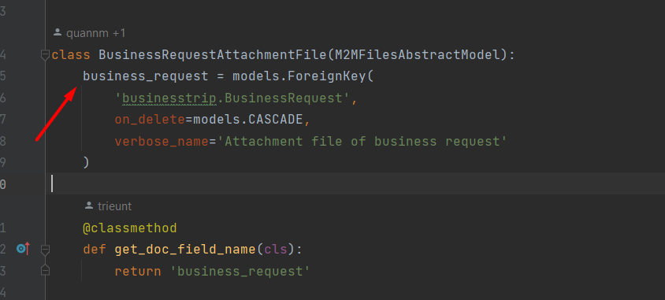
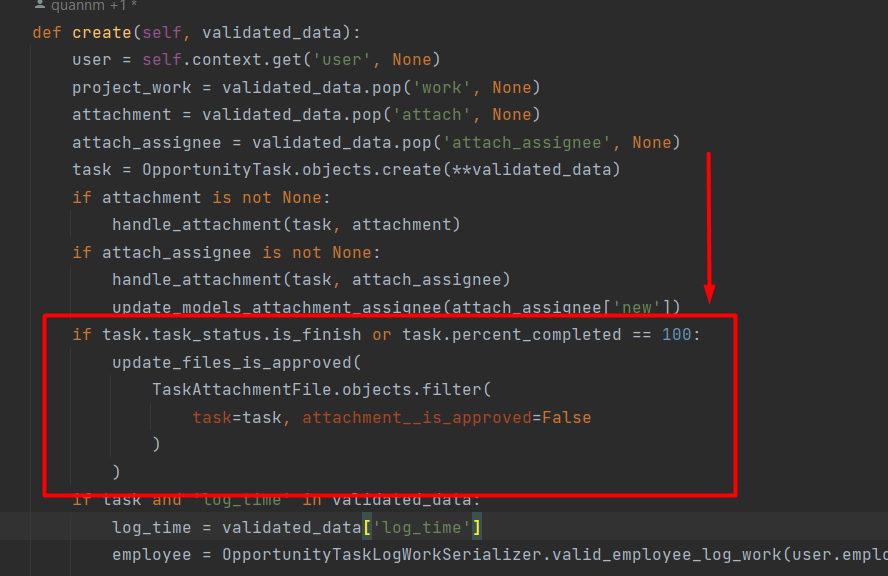
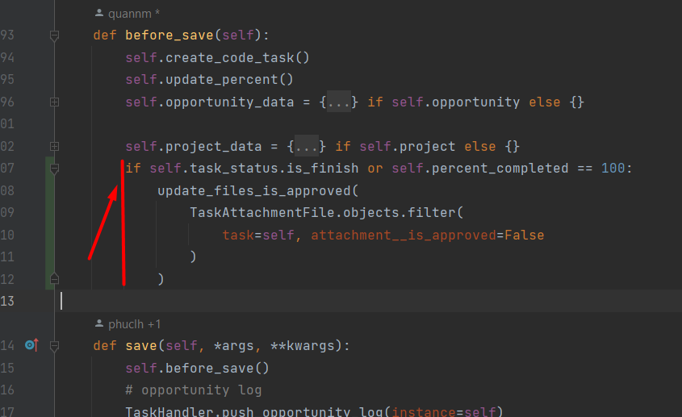

# Attachments app

---

Lịch sử phiên bản tài liệu (Document Revision History)
- ...
- 2023-12-27: Khởi tạo tài liệu
    ```text
    1. Mô tả việc sử dụng tính tổng dung lượng đã sử dụng của Company / Người dùng (employee)
    2. Hướng dẫn kiểm tra tập tin trên API
    ```

---

### Thông tin kho lưu trữ
1. Ở môi trường không sử dụng Cloud Storage thì việc đường dẫn đến tập tin sẽ luôn truy cập được!
2. Ở môi trường Cloud Storage việc trả URL sẽ thông tin method get_url() của attachments.Files hoặc attachments.PublicFiles để đảm bảo việc storage trả đúng đường dẫn truy cập - tự trả Presigned URL khi storage là Private!
3. Luôn kiểm tra quyền trước khi gọi get_url() vì bước get_url() không kiểm tra bất cứ quyền gì! Tốt nhất tuỳ vào chức năng mà truyền expire (seconds) vào hàm get_url()

### Thông tin luật
1. Private: Bắt buộc sử dụng Presigned URL -> nghĩa là nó sẽ hết hạn trên đường dẫn và cấp URL khi đã vượt qua bước kiểm tra quyền!
2. Public: Được sử dụng trong chức năng và có quyền truy cập từ mọi người mà không cần kiểm tra quyền + trả lại đường dẫn chính thức tới file không thông qua Presigned URL
3. Ngoài ra có 2 trường hợp đặc biệt đó là Logo Company và Avatar IMG Employee là lưu trực tiếp tại trường của Model -> Nó thuộc phạm vi Public nhưng không lưu trữ thông qua bảng Attachments.models.* nào!

### Thông tin Lưu trữ tập tin
1. Attachments.Files: Là các tập tin thuộc phạm vi private
2. Attachments.PublicFiles: Là các tập tin chức năng liên kết nhưng hỗ trợ việc luôn công khai
3. Attachments.M2MFilesAbstractModel: Là abtract model hỗ trợ cho các bảng ManyToMany của chức năng với attachments.Files

### Ngoài ra
```text
Các bước để tạo lập 1 PublicFiles từ chức năng (chức năng sản phẩm, ...) mong muốn sau khi tạo tệp mô tả/đính kèm của nó luôn công khai

B1: Client --[upload]--> Attachments.Files (của họ)
B2: Gọi tạo/cập nhật: Kiểm tra tập tin của họ hợp lệ
B3: Tiến hành tạo/cập nhật doc chính
B4: Di chuyển file từ attachments.Files sang attachments.PublicFiles của công ty (có thể gắn tên họ là employee_created)
B5: Link attachments.PublicFiles vừa chuyển xong với doc chính.

** Luôn yêu cầu người chỉnh sửa có đủ dụng lượng lưu trữ trong dung lượng của họ trước khi tập tin được chuyển sang khu vực public của công ty.
** Các phương thức còn thiếu cho việc chuyển tập tin này sẽ được cập nhật trong phiên bản tiếp theo. 
```

--- 

### Tính dung lượng đã sử dụng của Công Ty

Tổng của:
- attachments.Files lọc theo company_id. Sử dụng file_size (bytes) để tính.
- attachments.PublicFiles lọc them company_id. Sử dụng file_size (bytes) để tính.
- company.Company::logo lấy dữ liệu trường logo và gọi tính size (mặc định trường này tối đa 2MB)
- hr.Employee::avatar_img lọc them company_id và lấy trường avatar_img để gọi tính size (mặc định trường này tối đa 2MB)

---

### Tính dung lượng đã sử dụng của Nhân viên

Tổng của:
- attachments.Files lọc theo company_id & employee_id. Sử dụng file_size (bytes) để tính.
- **[*]Không tính dung lượng avatar của người này vào dung lượng đã sử dụng của họ mà tính vào company!**
- **[*]không tính dung lượng của Public Files vào dung lượng đã sử dụng của họ mà tính vào company!**

---

### Kiểm tra (validate) tập tin ID gửi từ người dùng và sử lý liên kết
1. Truyền context từ views vào serializer để biết ai đang gọi đến
```python
class XList(BaseCreateMixin):
  def post(self, request, *args, **kwargs):
    self.ser_context = {'user': request.user}
    ...
```
2. Ta có model M2M của chức năng tới Files như sau
```python
class XAttachmentFile(M2MFilesAbstractModel):
    x_y = models.ForeignKey(
        'x.X',
        on_delete=models.CASCADE,
        verbose_name='Attachment file of X'
    )

    @classmethod
    def get_doc_field_name(cls):
        return 'x_y'

    class Meta:
        ordering = ('-date_created',)
        ...
```
3. Hàm kiểm tra attachment ở serializers
```python
class XCreateSerializer(serializers.ModelSerializer):
    def validate_attachment(self, attrs):
        user = self.context.get('user', None)
        if user and hasattr(user, 'employee_current_id'):
            state, result = XAttachmentFile.valid_change(
                # doc_id = None khi tạo mới, còn update thì doc_id = self.instance.id
                current_ids=attrs, employee_id=user.employee_current_id, doc_id=None
            )
            if state is True:
                return result
            raise serializers.ValidationError({'attachment': AttachmentMsg.SOME_FILES_NOT_CORRECT})
        raise serializers.ValidationError({'employee_id': HRMsg.EMPLOYEE_NOT_EXIST})
```
4. Lấy trường attachment tại hàm create/update của serializer
```python
class XCreateSerializer(serializers.ModelSerializer):
    @decorator_run_workflow
    def create(self, validated_data):
        attachment = validated_data.pop('attachment', None) # pop sẽ lấy dữ liệu xoá key này khỏi validated_data
        ...
```
5. Xử lý liên kết
```python
class XCreateSerializer(serializers.ModelSerializer):
    @decorator_run_workflow
    def create(self, validated_data):
        attachment_result = validated_data.pop('attachment', None)
        instance = ...
        if attachment_result is not None:
            # get app theo ID của app đang xử lý
            relate_app = Application.objects.get(id="87ce1662-ca9d-403f-a32e-9553714ebc6d")
            state = XAttachmentFile.resolve_change(
                result=attachment_result, doc_id=instance.id, doc_app=relate_app,
            )
            if state:
                return instance
            # hạn chế thấp nhất việc đã tạo instance nhưng ngay đây lỗi!
            raise serializers.ValidationError({'attachment': AttachmentMsg.ERROR_VERIFY})
        return instance
```
6.

---

### Trả ra danh sách attachment đã liên kết với phiếu chính
```python
class XDetailSerializer(AbstractDetailSerializerModel):
    attachment = serializers.SerializerMethodField()
    
    @classmethod
    def get_attachment(cls, obj):
        att_objs = XAttachmentFile.objects.select_related('attachment').filter(
          **{
            XAttachmentFile.get_doc_field_name(): obj
          }
        )
        return [item.attachment.get_detail() for item in att_objs]

# có thể thay thế **{XAttachmentFile.get_doc_field_name(): obj} => field_name=obj
```

---
### 🔥 🔥 Hiển thị Tập tin trong KSM / Files khi phiếu đã approved 🔥🔥
- khi một phiếu được tạo có đính kèm tập tin. thì hệ thống tự sinh folder và lưu vào KMS -> files
- khi phiếu hoàn tất thì tập tin đó sẽ chuyển trạng thái approved và hiển thị trong file trên UI

##### ⚠️⚠️ Cách thực hiện
thêm hàm **update_files_is_approved** vào hàm save của models chức năng
```python
  update_files_is_approved(
    BusinessRequestAttachmentFile.objects.filter(
      business_request=self, attachment__is_approved=False
    ),
    self
  )
```

hàm được import từ file "models.py" trong folder core/attachments
```python
from apps.core.attachments.models import M2MFilesAbstractModel, update_files_is_approved
```
#### Mẫu tham khảo


##### Giải thích
1. 📝 **BusinessRequestAttachmentFile**
   - là abstract models manytomany của file và chức năng
2. 📝 **business_request**
   - là related field trong model đến chức năng <br> 
3. 📝 **attachment__is_approved**
   - là field mặc định trong abstract models M2M

Link tham khảo:
> eoffice / businesstrip / models / models.py line 130

### ⚠️⚠️AD HOC CASE với các app không cần workflow thì phải manual kiểm tra điều kiện theo rule của chức năng đó
### để add
xem một ví dụ ad hoc case như hình sau:

- ➡️ trong function create của class tạo thì chức năng này kiểm tra manual khi phiếu có stt (finish) hoặc phiếu hoàn
  thành 100% <br>

- ➡️ tương tự cho models của chức năng này thì khi update phiếu tự kiểm tra điều kiện

Link tham khảo:
> sales / task / models / task.py line 207 <br>
> sales / task / serializers / task.py line 272