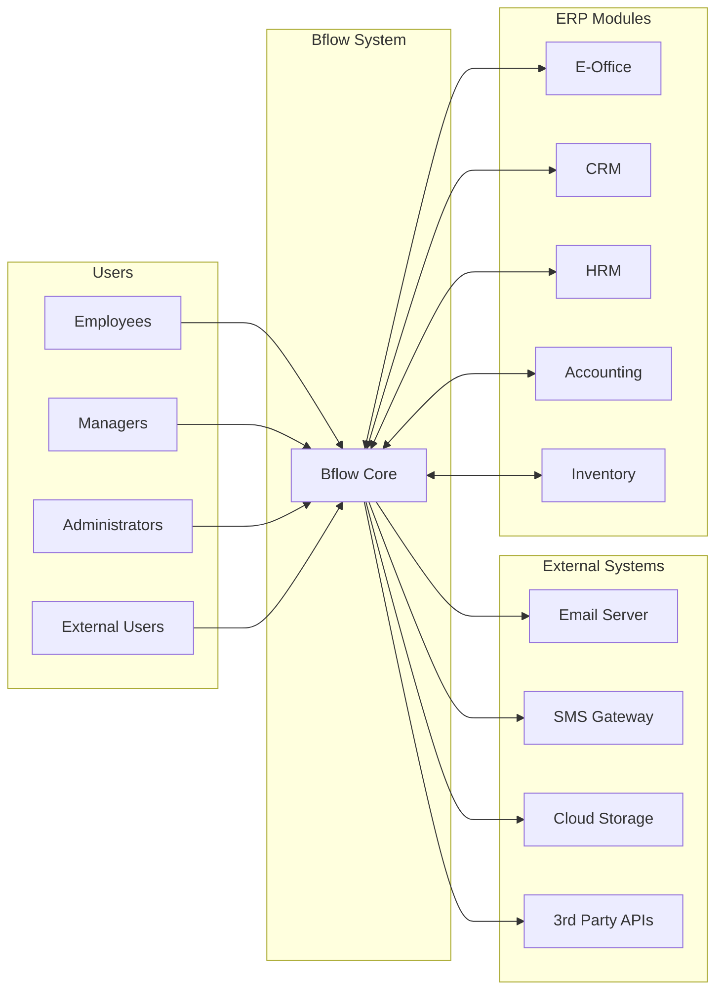
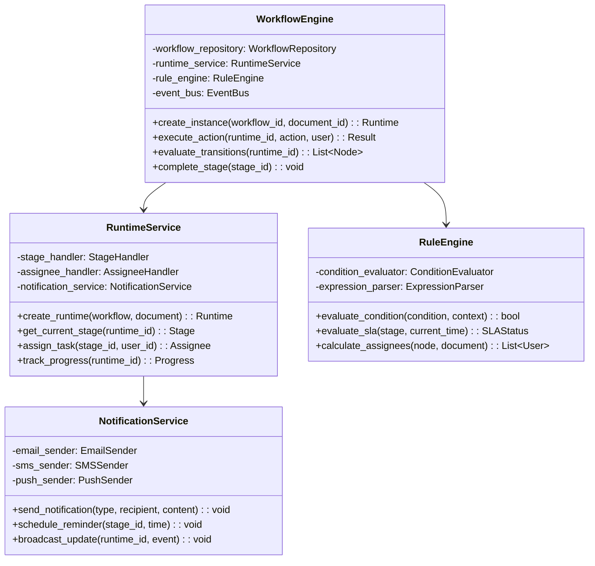
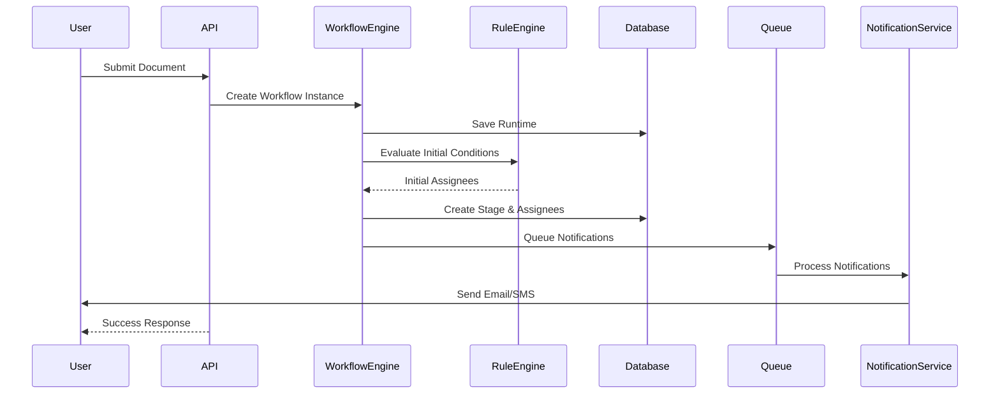
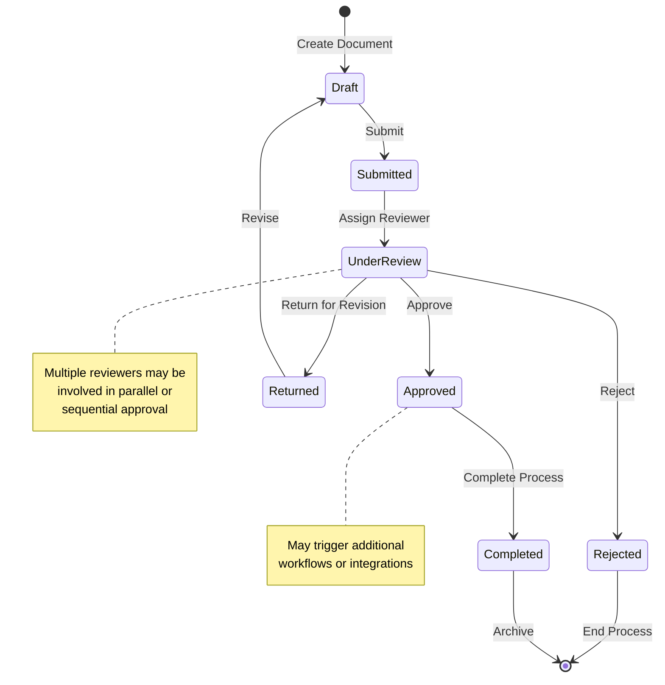
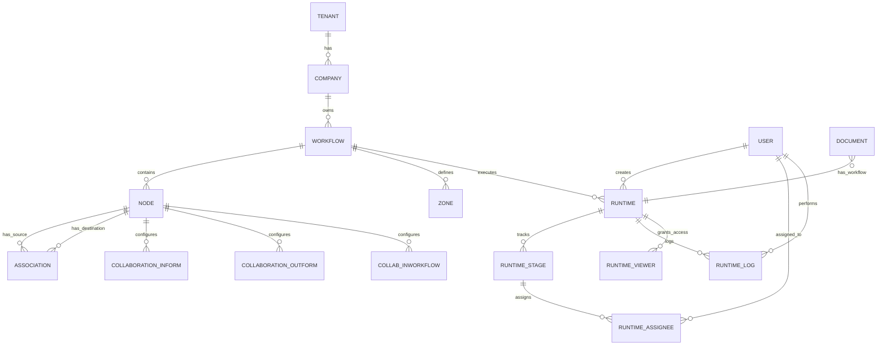
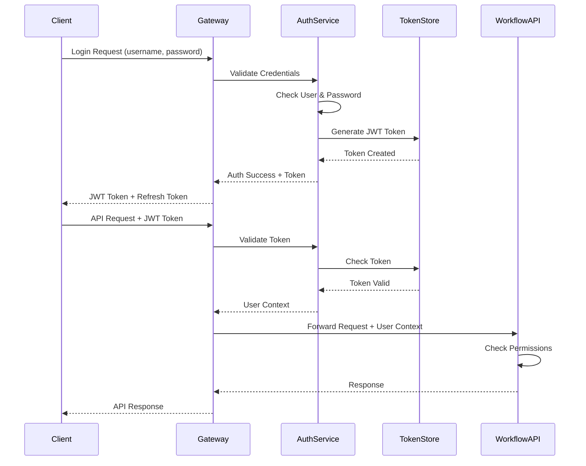
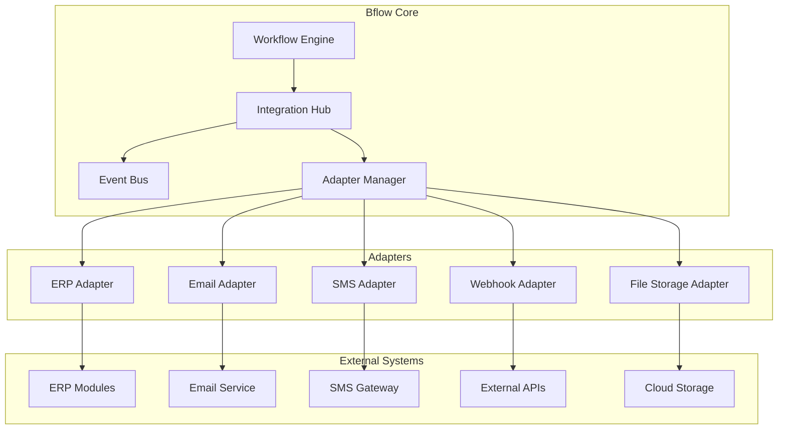

# System Design Document - Bflow Workflow Management System
**Version:** 1.0  
**Date:** 2025-07-25  
**Author:** Enterprise Architect  
**Status:** Draft

## 1. System Overview

### 1.1 System Context Diagram



### 1.2 System Components

| Component | Purpose | Technology |
|-----------|---------|------------|
| **Web Frontend** | User interface for workflow management | React/Vue.js |
| **API Gateway** | API routing, authentication, rate limiting | Kong/Nginx |
| **Workflow Engine** | Core workflow execution logic | Python/Django |
| **Rules Engine** | Business rule evaluation | Python |
| **Task Queue** | Asynchronous task processing | Celery/RabbitMQ |
| **Database** | Data persistence | MySQL |
| **Cache** | Performance optimization | Redis |
| **File Storage** | Document storage | S3/MinIO |
| **Monitoring** | System observability | Prometheus/Grafana |

## 2. Component Design

### 2.1 Workflow Engine Component



### 2.2 Data Flow Design



### 2.3 State Machine Design



## 3. Database Design

### 3.1 Entity Relationship Diagram



### 3.2 Core Tables Schema

```sql
-- Workflow Configuration Tables
CREATE TABLE workflow (
    id CHAR(36) PRIMARY KEY,
    tenant_id CHAR(36) NOT NULL,
    company_id CHAR(36) NOT NULL,
    app_id CHAR(36) NOT NULL,
    name VARCHAR(255) NOT NULL,
    description TEXT,
    is_multi_company BOOLEAN DEFAULT FALSE,
    is_applied BOOLEAN DEFAULT FALSE,
    zones JSON,
    created_at TIMESTAMP DEFAULT CURRENT_TIMESTAMP,
    updated_at TIMESTAMP DEFAULT CURRENT_TIMESTAMP ON UPDATE CURRENT_TIMESTAMP,
    
    INDEX idx_tenant_company (tenant_id, company_id),
    INDEX idx_app_applied (app_id, is_applied),
    FOREIGN KEY (tenant_id) REFERENCES tenant(id),
    FOREIGN KEY (company_id) REFERENCES company(id),
    FOREIGN KEY (app_id) REFERENCES application(id)
);

CREATE TABLE node (
    id CHAR(36) PRIMARY KEY,
    workflow_id CHAR(36) NOT NULL,
    name VARCHAR(255) NOT NULL,
    action SMALLINT NOT NULL,
    collaborator_option JSON,
    is_initial BOOLEAN DEFAULT FALSE,
    is_end BOOLEAN DEFAULT FALSE,
    is_initial_bastion BOOLEAN DEFAULT FALSE,
    coordinate JSON,
    created_at TIMESTAMP DEFAULT CURRENT_TIMESTAMP,
    
    INDEX idx_workflow_initial (workflow_id, is_initial),
    INDEX idx_workflow_action (workflow_id, action),
    FOREIGN KEY (workflow_id) REFERENCES workflow(id) ON DELETE CASCADE
);

CREATE TABLE association (
    id CHAR(36) PRIMARY KEY,
    workflow_id CHAR(36) NOT NULL,
    source_node_id CHAR(36) NOT NULL,
    dest_node_id CHAR(36) NOT NULL,
    condition JSON,
    created_at TIMESTAMP DEFAULT CURRENT_TIMESTAMP,
    
    UNIQUE KEY unique_association (workflow_id, source_node_id, dest_node_id),
    INDEX idx_source_node (source_node_id),
    INDEX idx_dest_node (dest_node_id),
    FOREIGN KEY (workflow_id) REFERENCES workflow(id) ON DELETE CASCADE,
    FOREIGN KEY (source_node_id) REFERENCES node(id) ON DELETE CASCADE,
    FOREIGN KEY (dest_node_id) REFERENCES node(id) ON DELETE CASCADE
);

-- Runtime Tables
CREATE TABLE runtime (
    id CHAR(36) PRIMARY KEY,
    tenant_id CHAR(36) NOT NULL,
    company_id CHAR(36) NOT NULL,
    workflow_id CHAR(36) NOT NULL,
    model_name VARCHAR(255) NOT NULL,
    object_id CHAR(36) NOT NULL,
    status VARCHAR(50) NOT NULL,
    created_by_id CHAR(36) NOT NULL,
    created_at TIMESTAMP DEFAULT CURRENT_TIMESTAMP,
    updated_at TIMESTAMP DEFAULT CURRENT_TIMESTAMP ON UPDATE CURRENT_TIMESTAMP,
    
    INDEX idx_tenant_company (tenant_id, company_id),
    INDEX idx_model_object (model_name, object_id),
    INDEX idx_workflow_status (workflow_id, status),
    INDEX idx_created_at (created_at),
    FOREIGN KEY (workflow_id) REFERENCES workflow(id)
);

CREATE TABLE runtime_stage (
    id CHAR(36) PRIMARY KEY,
    runtime_id CHAR(36) NOT NULL,
    node_id CHAR(36) NOT NULL,
    status VARCHAR(50) NOT NULL,
    task_bg_state VARCHAR(50),
    created_at TIMESTAMP DEFAULT CURRENT_TIMESTAMP,
    completed_at TIMESTAMP NULL,
    
    INDEX idx_runtime_status (runtime_id, status),
    INDEX idx_node_id (node_id),
    INDEX idx_created_at (created_at),
    FOREIGN KEY (runtime_id) REFERENCES runtime(id) ON DELETE CASCADE,
    FOREIGN KEY (node_id) REFERENCES node(id)
);

CREATE TABLE runtime_assignee (
    id CHAR(36) PRIMARY KEY,
    runtime_id CHAR(36) NOT NULL,
    runtime_stage_id CHAR(36) NOT NULL,
    assignee_id CHAR(36) NOT NULL,
    assign_type VARCHAR(50) NOT NULL,
    zone_assignee JSON,
    is_completed BOOLEAN DEFAULT FALSE,
    completed_at TIMESTAMP NULL,
    action_taken VARCHAR(50),
    comments TEXT,
    
    INDEX idx_runtime_assignee (runtime_id, assignee_id),
    INDEX idx_stage_status (runtime_stage_id, is_completed),
    INDEX idx_assignee_tasks (assignee_id, is_completed),
    FOREIGN KEY (runtime_id) REFERENCES runtime(id) ON DELETE CASCADE,
    FOREIGN KEY (runtime_stage_id) REFERENCES runtime_stage(id) ON DELETE CASCADE
);
```

### 3.3 Data Partitioning Strategy

```sql
-- Partition runtime tables by date for better performance
ALTER TABLE runtime_log
PARTITION BY RANGE (YEAR(created_at)) (
    PARTITION p2024 VALUES LESS THAN (2025),
    PARTITION p2025 VALUES LESS THAN (2026),
    PARTITION p2026 VALUES LESS THAN (2027),
    PARTITION pmax VALUES LESS THAN MAXVALUE
);

-- Archive old data
CREATE TABLE runtime_archive LIKE runtime;
CREATE TABLE runtime_stage_archive LIKE runtime_stage;
CREATE TABLE runtime_log_archive LIKE runtime_log;

-- Archive procedure
DELIMITER //
CREATE PROCEDURE archive_old_workflows()
BEGIN
    -- Archive completed workflows older than 1 year
    INSERT INTO runtime_archive
    SELECT * FROM runtime
    WHERE status = 'completed' 
    AND updated_at < DATE_SUB(NOW(), INTERVAL 1 YEAR);
    
    -- Archive related stages
    INSERT INTO runtime_stage_archive
    SELECT rs.* FROM runtime_stage rs
    INNER JOIN runtime_archive ra ON rs.runtime_id = ra.id;
    
    -- Delete archived data
    DELETE r, rs FROM runtime r
    INNER JOIN runtime_stage rs ON r.id = rs.runtime_id
    WHERE r.status = 'completed' 
    AND r.updated_at < DATE_SUB(NOW(), INTERVAL 1 YEAR);
END//
DELIMITER ;
```

## 4. API Design

### 4.1 RESTful API Structure

```yaml
openapi: 3.0.0
info:
  title: Bflow Workflow API
  version: 1.0.0
  description: API for workflow management system

paths:
  /api/v1/workflows:
    get:
      summary: List all workflows
      parameters:
        - name: app_id
          in: query
          schema:
            type: string
            format: uuid
        - name: is_active
          in: query
          schema:
            type: boolean
        - name: page
          in: query
          schema:
            type: integer
        - name: page_size
          in: query
          schema:
            type: integer
      responses:
        200:
          description: List of workflows
          content:
            application/json:
              schema:
                type: object
                properties:
                  count:
                    type: integer
                  next:
                    type: string
                  previous:
                    type: string
                  results:
                    type: array
                    items:
                      $ref: '#/components/schemas/Workflow'
    
    post:
      summary: Create new workflow
      requestBody:
        required: true
        content:
          application/json:
            schema:
              $ref: '#/components/schemas/WorkflowCreate'
      responses:
        201:
          description: Workflow created
          content:
            application/json:
              schema:
                $ref: '#/components/schemas/Workflow'

  /api/v1/workflows/{id}:
    get:
      summary: Get workflow details
      parameters:
        - name: id
          in: path
          required: true
          schema:
            type: string
            format: uuid
      responses:
        200:
          description: Workflow details
          content:
            application/json:
              schema:
                $ref: '#/components/schemas/WorkflowDetail'
    
    put:
      summary: Update workflow
      parameters:
        - name: id
          in: path
          required: true
          schema:
            type: string
            format: uuid
      requestBody:
        required: true
        content:
          application/json:
            schema:
              $ref: '#/components/schemas/WorkflowUpdate'
      responses:
        200:
          description: Workflow updated
    
    delete:
      summary: Delete workflow
      parameters:
        - name: id
          in: path
          required: true
          schema:
            type: string
            format: uuid
      responses:
        204:
          description: Workflow deleted

  /api/v1/runtime/execute:
    post:
      summary: Execute workflow on document
      requestBody:
        required: true
        content:
          application/json:
            schema:
              type: object
              properties:
                workflow_id:
                  type: string
                  format: uuid
                document_type:
                  type: string
                document_id:
                  type: string
                  format: uuid
      responses:
        201:
          description: Runtime created
          content:
            application/json:
              schema:
                $ref: '#/components/schemas/Runtime'

  /api/v1/tasks:
    get:
      summary: Get user tasks
      parameters:
        - name: status
          in: query
          schema:
            type: string
            enum: [pending, in_progress, completed]
        - name: assigned_to_me
          in: query
          schema:
            type: boolean
      responses:
        200:
          description: List of tasks
          content:
            application/json:
              schema:
                type: array
                items:
                  $ref: '#/components/schemas/Task'

  /api/v1/tasks/{id}/action:
    post:
      summary: Perform action on task
      parameters:
        - name: id
          in: path
          required: true
          schema:
            type: string
            format: uuid
      requestBody:
        required: true
        content:
          application/json:
            schema:
              type: object
              properties:
                action:
                  type: string
                  enum: [approve, reject, return, delegate]
                comments:
                  type: string
                delegate_to:
                  type: string
                  format: uuid
      responses:
        200:
          description: Action performed
          content:
            application/json:
              schema:
                type: object
                properties:
                  success:
                    type: boolean
                  next_stage:
                    type: string
                  message:
                    type: string

components:
  schemas:
    Workflow:
      type: object
      properties:
        id:
          type: string
          format: uuid
        name:
          type: string
        app_id:
          type: string
          format: uuid
        is_active:
          type: boolean
        created_at:
          type: string
          format: date-time
    
    WorkflowDetail:
      allOf:
        - $ref: '#/components/schemas/Workflow'
        - type: object
          properties:
            nodes:
              type: array
              items:
                $ref: '#/components/schemas/Node'
            associations:
              type: array
              items:
                $ref: '#/components/schemas/Association'
            zones:
              type: array
              items:
                type: object
    
    Node:
      type: object
      properties:
        id:
          type: string
          format: uuid
        name:
          type: string
        action:
          type: integer
        is_initial:
          type: boolean
        is_end:
          type: boolean
        collaborator_option:
          type: object
    
    Association:
      type: object
      properties:
        id:
          type: string
          format: uuid
        source_node_id:
          type: string
          format: uuid
        dest_node_id:
          type: string
          format: uuid
        condition:
          type: object
    
    Runtime:
      type: object
      properties:
        id:
          type: string
          format: uuid
        workflow_id:
          type: string
          format: uuid
        status:
          type: string
        current_stage:
          type: string
        created_at:
          type: string
          format: date-time
    
    Task:
      type: object
      properties:
        id:
          type: string
          format: uuid
        runtime_id:
          type: string
          format: uuid
        stage_name:
          type: string
        document_type:
          type: string
        document_title:
          type: string
        assigned_at:
          type: string
          format: date-time
        due_date:
          type: string
          format: date-time
        priority:
          type: string
          enum: [low, medium, high, urgent]
```

### 4.2 GraphQL Schema

```graphql
type Query {
  # Workflow queries
  workflows(appId: ID, isActive: Boolean, page: Int, pageSize: Int): WorkflowConnection!
  workflow(id: ID!): Workflow
  
  # Runtime queries
  runtimes(status: RuntimeStatus, page: Int, pageSize: Int): RuntimeConnection!
  runtime(id: ID!): Runtime
  
  # Task queries
  myTasks(status: TaskStatus, priority: Priority): [Task!]!
  task(id: ID!): Task
  
  # Analytics queries
  workflowMetrics(workflowId: ID!, dateRange: DateRange!): WorkflowMetrics!
  processAnalytics(filters: AnalyticsFilter!): ProcessAnalytics!
}

type Mutation {
  # Workflow mutations
  createWorkflow(input: CreateWorkflowInput!): Workflow!
  updateWorkflow(id: ID!, input: UpdateWorkflowInput!): Workflow!
  deleteWorkflow(id: ID!): Boolean!
  
  # Runtime mutations
  executeWorkflow(input: ExecuteWorkflowInput!): Runtime!
  
  # Task mutations
  performAction(taskId: ID!, action: TaskAction!, comments: String): ActionResult!
  delegateTask(taskId: ID!, delegateToId: ID!, comments: String): Task!
}

type Subscription {
  # Real-time updates
  taskAssigned(userId: ID!): Task!
  workflowStatusChanged(runtimeId: ID!): Runtime!
  stageCompleted(runtimeId: ID!): Stage!
}

type Workflow {
  id: ID!
  name: String!
  description: String
  app: Application!
  nodes: [Node!]!
  associations: [Association!]!
  zones: [Zone!]!
  isActive: Boolean!
  isMultiCompany: Boolean!
  createdAt: DateTime!
  updatedAt: DateTime!
}

type Node {
  id: ID!
  name: String!
  action: WorkflowAction!
  isInitial: Boolean!
  isEnd: Boolean!
  collaboratorOption: CollaboratorOption
  position: Coordinate!
  outgoingAssociations: [Association!]!
  incomingAssociations: [Association!]!
}

type Association {
  id: ID!
  sourceNode: Node!
  destNode: Node!
  condition: Condition
}

type Runtime {
  id: ID!
  workflow: Workflow!
  document: Document!
  status: RuntimeStatus!
  currentStage: Stage
  stages: [Stage!]!
  logs: [RuntimeLog!]!
  createdBy: User!
  createdAt: DateTime!
  completedAt: DateTime
}

type Task {
  id: ID!
  runtime: Runtime!
  stage: Stage!
  assignee: User!
  status: TaskStatus!
  priority: Priority!
  dueDate: DateTime
  assignedAt: DateTime!
  completedAt: DateTime
  actionTaken: TaskAction
  comments: String
  zones: [ZonePermission!]!
}

# Enums
enum WorkflowAction {
  CREATE
  APPROVE
  REJECT
  RETURN
  RECEIVE
  TODO
}

enum RuntimeStatus {
  PENDING
  IN_PROGRESS
  COMPLETED
  CANCELLED
  ERROR
}

enum TaskStatus {
  PENDING
  IN_PROGRESS
  COMPLETED
  OVERDUE
}

enum TaskAction {
  APPROVE
  REJECT
  RETURN
  DELEGATE
  COMPLETE
}

enum Priority {
  LOW
  MEDIUM
  HIGH
  URGENT
}

# Input types
input CreateWorkflowInput {
  name: String!
  description: String
  appId: ID!
  nodes: [CreateNodeInput!]!
  associations: [CreateAssociationInput!]!
  zones: [CreateZoneInput!]!
}

input ExecuteWorkflowInput {
  workflowId: ID!
  documentType: String!
  documentId: ID!
  initialData: JSON
}

input AnalyticsFilter {
  workflowIds: [ID!]
  dateRange: DateRange!
  groupBy: GroupBy!
}

# Complex types
type WorkflowMetrics {
  totalExecutions: Int!
  averageCompletionTime: Float!
  successRate: Float!
  bottlenecks: [Bottleneck!]!
  slaCompliance: Float!
}

type ProcessAnalytics {
  processMap: ProcessMap!
  performanceMetrics: PerformanceMetrics!
  complianceReport: ComplianceReport!
}
```

### 4.3 Event-Driven API (WebSocket)

```javascript
// WebSocket event definitions
const WorkflowEvents = {
  // Client -> Server events
  SUBSCRIBE_RUNTIME: 'subscribe_runtime',
  UNSUBSCRIBE_RUNTIME: 'unsubscribe_runtime',
  SUBSCRIBE_TASKS: 'subscribe_tasks',
  
  // Server -> Client events
  RUNTIME_CREATED: 'runtime_created',
  STAGE_STARTED: 'stage_started',
  STAGE_COMPLETED: 'stage_completed',
  TASK_ASSIGNED: 'task_assigned',
  TASK_COMPLETED: 'task_completed',
  WORKFLOW_COMPLETED: 'workflow_completed',
  ERROR_OCCURRED: 'error_occurred'
};

// WebSocket connection example
class WorkflowWebSocket {
  constructor(url, token) {
    this.ws = new WebSocket(url);
    this.token = token;
    this.subscriptions = new Set();
    
    this.ws.onopen = () => {
      this.authenticate();
    };
    
    this.ws.onmessage = (event) => {
      this.handleMessage(JSON.parse(event.data));
    };
  }
  
  authenticate() {
    this.send({
      type: 'AUTH',
      token: this.token
    });
  }
  
  subscribeRuntime(runtimeId) {
    this.send({
      type: WorkflowEvents.SUBSCRIBE_RUNTIME,
      runtimeId: runtimeId
    });
    this.subscriptions.add(runtimeId);
  }
  
  subscribeTasks(userId) {
    this.send({
      type: WorkflowEvents.SUBSCRIBE_TASKS,
      userId: userId
    });
  }
  
  handleMessage(message) {
    switch(message.type) {
      case WorkflowEvents.TASK_ASSIGNED:
        this.onTaskAssigned(message.data);
        break;
      case WorkflowEvents.STAGE_COMPLETED:
        this.onStageCompleted(message.data);
        break;
      case WorkflowEvents.WORKFLOW_COMPLETED:
        this.onWorkflowCompleted(message.data);
        break;
      case WorkflowEvents.ERROR_OCCURRED:
        this.onError(message.data);
        break;
    }
  }
  
  send(data) {
    this.ws.send(JSON.stringify(data));
  }
}

// Server-side WebSocket handler
class WorkflowWebSocketHandler {
  constructor(io) {
    this.io = io;
    this.userSockets = new Map();
    this.runtimeSubscriptions = new Map();
  }
  
  handleConnection(socket) {
    socket.on('AUTH', (data) => {
      const user = this.validateToken(data.token);
      if (user) {
        this.userSockets.set(user.id, socket);
        socket.userId = user.id;
        socket.emit('AUTH_SUCCESS');
      } else {
        socket.emit('AUTH_FAILED');
        socket.disconnect();
      }
    });
    
    socket.on(WorkflowEvents.SUBSCRIBE_RUNTIME, (data) => {
      this.subscribeToRuntime(socket, data.runtimeId);
    });
    
    socket.on(WorkflowEvents.SUBSCRIBE_TASKS, (data) => {
      socket.join(`user_tasks_${data.userId}`);
    });
    
    socket.on('disconnect', () => {
      this.handleDisconnect(socket);
    });
  }
  
  // Emit events to subscribed clients
  notifyTaskAssigned(task) {
    const room = `user_tasks_${task.assignee_id}`;
    this.io.to(room).emit(WorkflowEvents.TASK_ASSIGNED, {
      task: task,
      timestamp: new Date()
    });
  }
  
  notifyStageCompleted(runtime, stage) {
    const room = `runtime_${runtime.id}`;
    this.io.to(room).emit(WorkflowEvents.STAGE_COMPLETED, {
      runtime: runtime,
      stage: stage,
      timestamp: new Date()
    });
  }
}
```

## 5. Security Design

### 5.1 Authentication & Authorization Flow



### 5.2 Security Layers

```python
# Multi-layer security implementation
class SecurityFramework:
    def __init__(self):
        self.auth_backend = JWTAuthentication()
        self.permission_checker = PermissionChecker()
        self.rate_limiter = RateLimiter()
        self.audit_logger = AuditLogger()
    
    def authenticate(self, request):
        # Layer 1: Token validation
        token = self.extract_token(request)
        user = self.auth_backend.authenticate(token)
        
        # Layer 2: Session validation
        if not self.validate_session(user, request):
            raise InvalidSessionError()
        
        # Layer 3: IP validation
        if not self.validate_ip(user, request.ip):
            raise IPNotAllowedError()
        
        return user
    
    def authorize(self, user, resource, action):
        # Layer 1: Role-based access
        if not self.permission_checker.has_role_permission(user, resource, action):
            return False
        
        # Layer 2: Attribute-based access
        if not self.permission_checker.check_attributes(user, resource):
            return False
        
        # Layer 3: Context-based access
        if not self.permission_checker.check_context(user, resource, action):
            return False
        
        return True
    
    def enforce_security_policies(self, request, user):
        # Rate limiting
        if not self.rate_limiter.check_limit(user, request.endpoint):
            raise RateLimitExceededError()
        
        # Data loss prevention
        if self.contains_sensitive_data(request.data):
            self.audit_logger.log_dlp_violation(user, request)
            raise DataLeakPreventionError()
        
        # Audit logging
        self.audit_logger.log_access(user, request)

# Permission model
class WorkflowPermission:
    ACTIONS = {
        'view': 'Can view workflow',
        'create': 'Can create workflow',
        'edit': 'Can edit workflow',
        'delete': 'Can delete workflow',
        'execute': 'Can execute workflow',
        'approve': 'Can approve tasks',
        'admin': 'Full administrative access'
    }
    
    @staticmethod
    def check_permission(user, workflow, action):
        # Check explicit permissions
        if user.has_perm(f'workflow.{action}_workflow'):
            return True
        
        # Check workflow-specific permissions
        if workflow.created_by == user:
            return action in ['view', 'edit', 'execute']
        
        # Check role-based permissions
        if user.role == 'workflow_admin':
            return True
        
        # Check dynamic permissions
        if action == 'approve':
            return RuntimeAssignee.objects.filter(
                assignee=user,
                runtime__workflow=workflow,
                is_completed=False
            ).exists()
        
        return False
```

### 5.3 Data Security

```python
# Encryption and data protection
from cryptography.fernet import Fernet
from django.db import models

class EncryptedField(models.TextField):
    def __init__(self, *args, **kwargs):
        self.cipher_suite = Fernet(settings.FIELD_ENCRYPTION_KEY)
        super().__init__(*args, **kwargs)
    
    def get_prep_value(self, value):
        if value is None:
            return value
        encrypted = self.cipher_suite.encrypt(value.encode())
        return encrypted.decode()
    
    def from_db_value(self, value, expression, connection):
        if value is None:
            return value
        decrypted = self.cipher_suite.decrypt(value.encode())
        return decrypted.decode()

# Secure workflow model
class SecureWorkflow(models.Model):
    # Encrypted fields
    sensitive_data = EncryptedField()
    api_credentials = EncryptedField()
    
    # Audit fields
    last_access_by = models.ForeignKey(User, null=True)
    last_access_at = models.DateTimeField(null=True)
    access_count = models.IntegerField(default=0)
    
    def access(self, user):
        # Track access
        self.last_access_by = user
        self.last_access_at = timezone.now()
        self.access_count += 1
        self.save()
        
        # Log access
        AuditLog.objects.create(
            user=user,
            action='workflow_access',
            object_id=self.id,
            ip_address=get_client_ip()
        )
    
    class Meta:
        permissions = [
            ('view_sensitive_data', 'Can view sensitive workflow data'),
            ('export_workflow', 'Can export workflow configuration'),
            ('import_workflow', 'Can import workflow configuration'),
        ]
```

## 6. Integration Design

### 6.1 Integration Architecture



### 6.2 Integration Patterns

```python
# Adapter pattern for integrations
from abc import ABC, abstractmethod

class IntegrationAdapter(ABC):
    @abstractmethod
    def connect(self):
        pass
    
    @abstractmethod
    def send(self, data):
        pass
    
    @abstractmethod
    def receive(self):
        pass
    
    @abstractmethod
    def disconnect(self):
        pass

class ERPIntegrationAdapter(IntegrationAdapter):
    def __init__(self, config):
        self.config = config
        self.connection = None
    
    def connect(self):
        # Connect to ERP system
        self.connection = ERPConnection(
            host=self.config['host'],
            port=self.config['port'],
            credentials=self.config['credentials']
        )
    
    def send(self, data):
        # Transform and send data to ERP
        transformed_data = self.transform_to_erp_format(data)
        response = self.connection.post('/api/workflow', transformed_data)
        return self.transform_from_erp_format(response)
    
    def receive(self):
        # Poll for updates from ERP
        updates = self.connection.get('/api/workflow/updates')
        return [self.transform_from_erp_format(u) for u in updates]
    
    def disconnect(self):
        if self.connection:
            self.connection.close()

# Event-driven integration
class IntegrationEventHandler:
    def __init__(self):
        self.adapters = {}
        self.event_mappings = {
            'workflow.started': self.handle_workflow_started,
            'stage.completed': self.handle_stage_completed,
            'workflow.completed': self.handle_workflow_completed
        }
    
    def register_adapter(self, name, adapter):
        self.adapters[name] = adapter
    
    def handle_event(self, event):
        handler = self.event_mappings.get(event.type)
        if handler:
            handler(event)
    
    def handle_workflow_started(self, event):
        # Notify external systems
        for adapter in self.adapters.values():
            try:
                adapter.send({
                    'type': 'workflow_started',
                    'workflow_id': event.workflow_id,
                    'document_id': event.document_id,
                    'timestamp': event.timestamp
                })
            except Exception as e:
                logger.error(f"Integration error: {e}")
    
    def handle_stage_completed(self, event):
        # Trigger integrations based on stage
        stage_config = event.stage.integration_config
        if stage_config:
            adapter = self.adapters.get(stage_config['adapter'])
            if adapter:
                adapter.send(stage_config['data'])
```

### 6.3 Webhook Management

```python
class WebhookManager:
    def __init__(self):
        self.redis_client = redis.Redis()
        self.retry_policy = RetryPolicy(max_attempts=3, backoff=2)
    
    def register_webhook(self, webhook_config):
        webhook = Webhook.objects.create(
            url=webhook_config['url'],
            events=webhook_config['events'],
            secret=self.generate_secret(),
            is_active=True
        )
        return webhook
    
    def trigger_webhook(self, event, webhook):
        payload = self.build_payload(event)
        signature = self.sign_payload(payload, webhook.secret)
        
        # Queue for delivery
        task = deliver_webhook.apply_async(
            args=[webhook.id, payload, signature],
            retry_policy=self.retry_policy
        )
        
        # Track delivery
        WebhookDelivery.objects.create(
            webhook=webhook,
            event_type=event.type,
            payload=payload,
            task_id=task.id
        )
    
    @celery.task(bind=True)
    def deliver_webhook(self, webhook_id, payload, signature):
        webhook = Webhook.objects.get(id=webhook_id)
        
        headers = {
            'Content-Type': 'application/json',
            'X-Webhook-Signature': signature,
            'X-Webhook-ID': str(webhook.id)
        }
        
        try:
            response = requests.post(
                webhook.url,
                json=payload,
                headers=headers,
                timeout=30
            )
            response.raise_for_status()
            
            # Update delivery status
            WebhookDelivery.objects.filter(
                webhook_id=webhook_id,
                task_id=self.request.id
            ).update(
                status='delivered',
                response_code=response.status_code,
                delivered_at=timezone.now()
            )
            
        except Exception as e:
            # Log failure and retry
            logger.error(f"Webhook delivery failed: {e}")
            raise self.retry(exc=e)
```

## 7. Performance Optimization

### 7.1 Caching Strategy

```python
# Multi-level caching
class CacheManager:
    def __init__(self):
        self.local_cache = caches['local']  # In-memory cache
        self.distributed_cache = caches['redis']  # Redis cache
        self.cache_times = {
            'workflow_config': 3600,  # 1 hour
            'user_permissions': 300,  # 5 minutes
            'runtime_data': 60,  # 1 minute
            'static_data': 86400  # 24 hours
        }
    
    def get_or_set(self, key, func, cache_type='workflow_config'):
        # Try local cache first
        value = self.local_cache.get(key)
        if value is not None:
            return value
        
        # Try distributed cache
        value = self.distributed_cache.get(key)
        if value is not None:
            # Update local cache
            self.local_cache.set(key, value, 60)  # Short TTL
            return value
        
        # Compute value
        value = func()
        
        # Set in both caches
        ttl = self.cache_times.get(cache_type, 300)
        self.distributed_cache.set(key, value, ttl)
        self.local_cache.set(key, value, min(ttl, 300))
        
        return value
    
    def invalidate(self, pattern):
        # Invalidate matching keys
        if '*' in pattern:
            # Clear pattern from Redis
            for key in self.distributed_cache.keys(pattern):
                self.distributed_cache.delete(key)
        else:
            # Clear specific key
            self.local_cache.delete(pattern)
            self.distributed_cache.delete(pattern)

# Query optimization
class OptimizedWorkflowQuerySet(models.QuerySet):
    def with_details(self):
        return self.select_related(
            'app',
            'created_by',
            'updated_by'
        ).prefetch_related(
            'nodes__collaborations_inform',
            'nodes__collaborations_outform',
            'nodes__collab_inworkflow',
            'associations',
            'zones'
        )
    
    def active_for_app(self, app_id):
        return self.filter(
            app_id=app_id,
            is_applied=True
        ).with_details()
    
    def search(self, query):
        return self.filter(
            Q(name__icontains=query) |
            Q(description__icontains=query)
        ).with_details()

class WorkflowManager(models.Manager):
    def get_queryset(self):
        return OptimizedWorkflowQuerySet(self.model, using=self._db)
    
    def get_cached(self, workflow_id):
        cache_key = f'workflow:{workflow_id}'
        return cache_manager.get_or_set(
            cache_key,
            lambda: self.get_queryset().with_details().get(id=workflow_id),
            'workflow_config'
        )
```

### 7.2 Database Optimization

```sql
-- Indexes for performance
CREATE INDEX idx_runtime_lookup ON runtime(tenant_id, company_id, model_name, object_id);
CREATE INDEX idx_runtime_status ON runtime(status, created_at);
CREATE INDEX idx_stage_runtime ON runtime_stage(runtime_id, status, created_at);
CREATE INDEX idx_assignee_user ON runtime_assignee(assignee_id, is_completed, created_at);
CREATE INDEX idx_log_runtime ON runtime_log(runtime_id, created_at);

-- Composite indexes for common queries
CREATE INDEX idx_workflow_active ON workflow(tenant_id, company_id, app_id, is_applied);
CREATE INDEX idx_node_workflow ON node(workflow_id, is_initial, action);
CREATE INDEX idx_association_lookup ON association(workflow_id, source_node_id);

-- Materialized view for analytics
CREATE MATERIALIZED VIEW workflow_analytics AS
SELECT 
    w.id as workflow_id,
    w.name as workflow_name,
    COUNT(DISTINCT r.id) as total_executions,
    AVG(TIMESTAMPDIFF(SECOND, r.created_at, r.updated_at)) as avg_completion_time,
    SUM(CASE WHEN r.status = 'completed' THEN 1 ELSE 0 END) / COUNT(*) as success_rate,
    DATE(r.created_at) as execution_date
FROM workflow w
LEFT JOIN runtime r ON w.id = r.workflow_id
GROUP BY w.id, DATE(r.created_at)
WITH DATA;

-- Refresh materialized view daily
CREATE EVENT refresh_workflow_analytics
ON SCHEDULE EVERY 1 DAY
DO REFRESH MATERIALIZED VIEW workflow_analytics;
```

### 7.3 Asynchronous Processing

```python
# Async task processing with Celery
@celery.task(bind=True, max_retries=3)
def process_workflow_stage(self, runtime_id, stage_id):
    try:
        runtime = Runtime.objects.get(id=runtime_id)
        stage = RuntimeStage.objects.get(id=stage_id)
        
        # Process stage asynchronously
        with transaction.atomic():
            # Execute business logic
            result = WorkflowEngine().process_stage(runtime, stage)
            
            # Update stage status
            stage.status = 'completed'
            stage.completed_at = timezone.now()
            stage.save()
            
            # Trigger next stages
            next_stages = WorkflowEngine().get_next_stages(runtime, stage)
            for next_stage in next_stages:
                process_workflow_stage.delay(runtime_id, next_stage.id)
        
        # Send notifications
        send_stage_notifications.delay(stage_id)
        
        return {'status': 'success', 'stage_id': stage_id}
        
    except Exception as e:
        logger.error(f"Stage processing failed: {e}")
        # Retry with exponential backoff
        raise self.retry(exc=e, countdown=2 ** self.request.retries)

# Batch processing for better performance
@celery.task
def batch_process_tasks(task_ids):
    tasks = RuntimeAssignee.objects.filter(
        id__in=task_ids
    ).select_related('runtime', 'runtime_stage')
    
    # Process in batches
    for batch in chunks(tasks, 100):
        with transaction.atomic():
            for task in batch:
                # Process task
                process_single_task(task)
            
            # Bulk update
            RuntimeAssignee.objects.bulk_update(
                batch, 
                ['status', 'completed_at', 'action_taken']
            )
    
    # Send batch notifications
    send_batch_notifications.delay([t.id for t in tasks])
```

## 8. Monitoring & Observability

### 8.1 Metrics Collection

```python
# Prometheus metrics
from prometheus_client import Counter, Histogram, Gauge

# Define metrics
workflow_executions = Counter(
    'workflow_executions_total',
    'Total number of workflow executions',
    ['workflow_name', 'status']
)

workflow_duration = Histogram(
    'workflow_duration_seconds',
    'Workflow execution duration',
    ['workflow_name'],
    buckets=[10, 30, 60, 120, 300, 600, 1800, 3600]
)

active_workflows = Gauge(
    'active_workflows',
    'Number of active workflow instances',
    ['workflow_name']
)

task_queue_size = Gauge(
    'task_queue_size',
    'Number of tasks in queue',
    ['priority']
)

# Instrument code
class MetricsMiddleware:
    def __init__(self, get_response):
        self.get_response = get_response
    
    def __call__(self, request):
        # Track request
        start_time = time.time()
        
        response = self.get_response(request)
        
        # Record metrics
        duration = time.time() - start_time
        http_requests.labels(
            method=request.method,
            endpoint=request.path,
            status=response.status_code
        ).observe(duration)
        
        return response

# Custom workflow metrics
def track_workflow_execution(workflow, status):
    workflow_executions.labels(
        workflow_name=workflow.name,
        status=status
    ).inc()
    
    if status == 'started':
        active_workflows.labels(workflow_name=workflow.name).inc()
    elif status in ['completed', 'failed']:
        active_workflows.labels(workflow_name=workflow.name).dec()
```

### 8.2 Logging Structure

```python
# Structured logging
import structlog

logger = structlog.get_logger()

class WorkflowLogger:
    @staticmethod
    def log_workflow_event(event_type, **kwargs):
        logger.info(
            event_type,
            workflow_id=kwargs.get('workflow_id'),
            runtime_id=kwargs.get('runtime_id'),
            user_id=kwargs.get('user_id'),
            tenant_id=kwargs.get('tenant_id'),
            timestamp=timezone.now().isoformat(),
            **kwargs
        )
    
    @staticmethod
    def log_error(error, **context):
        logger.error(
            'workflow_error',
            error_type=type(error).__name__,
            error_message=str(error),
            traceback=traceback.format_exc(),
            **context
        )

# Logging configuration
LOGGING = {
    'version': 1,
    'disable_existing_loggers': False,
    'formatters': {
        'json': {
            '()': structlog.stdlib.ProcessorFormatter,
            'processor': structlog.processors.JSONRenderer(),
        },
    },
    'handlers': {
        'console': {
            'class': 'logging.StreamHandler',
            'formatter': 'json',
        },
        'file': {
            'class': 'logging.handlers.RotatingFileHandler',
            'filename': '/var/log/bflow/workflow.log',
            'maxBytes': 10485760,  # 10MB
            'backupCount': 5,
            'formatter': 'json',
        },
    },
    'loggers': {
        'workflow': {
            'handlers': ['console', 'file'],
            'level': 'INFO',
            'propagate': False,
        },
    },
}
```

### 8.3 Health Checks

```python
# Health check endpoints
class HealthCheckView(APIView):
    permission_classes = [AllowAny]
    
    def get(self, request):
        checks = {
            'database': self.check_database(),
            'cache': self.check_cache(),
            'queue': self.check_queue(),
            'storage': self.check_storage()
        }
        
        overall_status = all(check['status'] == 'healthy' for check in checks.values())
        
        return Response({
            'status': 'healthy' if overall_status else 'unhealthy',
            'timestamp': timezone.now().isoformat(),
            'checks': checks
        }, status=200 if overall_status else 503)
    
    def check_database(self):
        try:
            connection.ensure_connection()
            return {'status': 'healthy', 'latency': connection.queries_log[-1]['time']}
        except Exception as e:
            return {'status': 'unhealthy', 'error': str(e)}
    
    def check_cache(self):
        try:
            cache.set('health_check', 'ok', 1)
            value = cache.get('health_check')
            return {'status': 'healthy' if value == 'ok' else 'unhealthy'}
        except Exception as e:
            return {'status': 'unhealthy', 'error': str(e)}
    
    def check_queue(self):
        try:
            inspector = celery.control.inspect()
            stats = inspector.stats()
            return {'status': 'healthy' if stats else 'unhealthy', 'workers': len(stats or {})}
        except Exception as e:
            return {'status': 'unhealthy', 'error': str(e)}
```

## 9. Disaster Recovery

### 9.1 Backup Strategy

```yaml
# Backup configuration
backup:
  database:
    type: mysql
    schedule: "0 2 * * *"  # Daily at 2 AM
    retention: 30  # days
    destinations:
      - type: s3
        bucket: bflow-backups
        path: database/
      - type: local
        path: /backup/database/
  
  files:
    type: incremental
    schedule: "0 */6 * * *"  # Every 6 hours
    retention: 7  # days
    destinations:
      - type: s3
        bucket: bflow-backups
        path: files/
  
  configurations:
    type: git
    repository: git@gitlab.com:bflow/configs.git
    branch: backup
    schedule: "0 0 * * *"  # Daily
```

### 9.2 Recovery Procedures

```python
# Disaster recovery automation
class DisasterRecovery:
    def __init__(self):
        self.backup_manager = BackupManager()
        self.health_checker = HealthChecker()
    
    def initiate_recovery(self, failure_type):
        recovery_plan = self.get_recovery_plan(failure_type)
        
        for step in recovery_plan:
            try:
                self.execute_step(step)
                self.verify_step(step)
            except Exception as e:
                self.escalate_to_human(step, e)
                break
    
    def get_recovery_plan(self, failure_type):
        plans = {
            'database_failure': [
                {'action': 'switch_to_standby_db'},
                {'action': 'restore_from_backup'},
                {'action': 'replay_transaction_log'},
                {'action': 'verify_data_integrity'}
            ],
            'service_failure': [
                {'action': 'restart_failed_services'},
                {'action': 'scale_healthy_instances'},
                {'action': 'update_load_balancer'},
                {'action': 'verify_service_health'}
            ],
            'complete_failure': [
                {'action': 'activate_dr_site'},
                {'action': 'restore_all_services'},
                {'action': 'verify_system_integrity'},
                {'action': 'switch_dns'}
            ]
        }
        return plans.get(failure_type, [])
```

## 10. Conclusion

System Design này cung cấp một kiến trúc toàn diện cho Bflow Workflow Management System với các đặc điểm:

### Strengths:
- **Scalable Architecture**: Hỗ trợ horizontal scaling
- **High Performance**: Caching, async processing, query optimization
- **Secure**: Multi-layer security, encryption, audit trails
- **Observable**: Comprehensive monitoring và logging
- **Resilient**: Disaster recovery và high availability

### Key Design Decisions:
1. **API-First**: RESTful và GraphQL APIs
2. **Event-Driven**: Asynchronous processing với Celery
3. **Microservices Ready**: Modular design cho future decomposition
4. **Cloud Native**: Container-based deployment
5. **Multi-Tenant**: Built-in tenant isolation

### Next Steps:
1. Implement proof of concept
2. Performance testing
3. Security audit
4. Production deployment planning

---
**Document Control:**
- Review Cycle: Quarterly
- Next Review: 2025-10-25
- Approval: Architecture Board