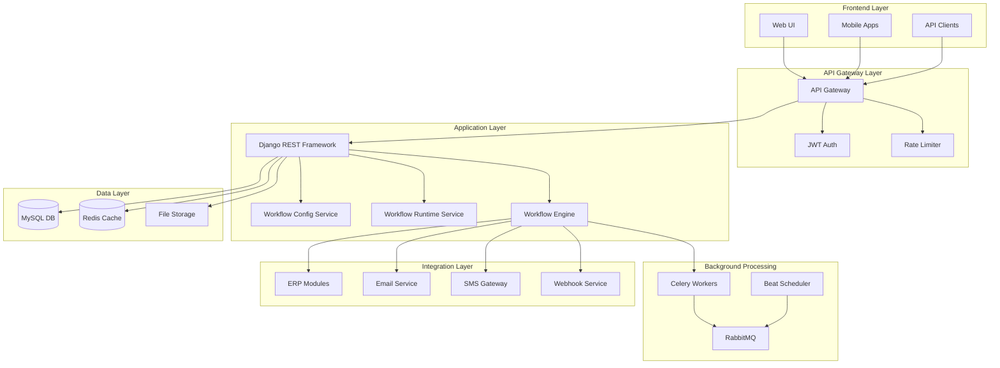
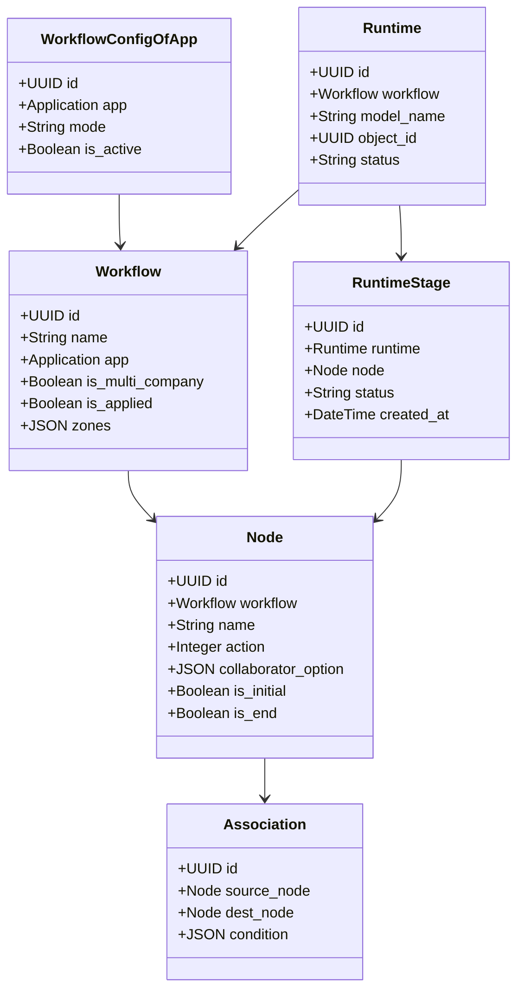
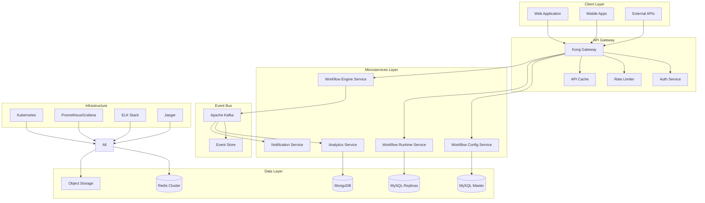

# Technical Architecture Document - Bflow Workflow Management System
**Version:** 1.0  
**Date:** 2025-07-25  
**Author:** CTO / Enterprise Architect  
**Status:** Draft

## Executive Summary

Tài liệu này trình bày kiến trúc kỹ thuật chi tiết của hệ thống Bflow, đánh giá thiết kế hiện tại so với best practices, và đề xuất các cải tiến. Bflow được xây dựng trên nền tảng Django với kiến trúc modular, hỗ trợ multi-tenant, và tích hợp sâu với các module ERP khác.

### Key Findings:
- ✅ **Strengths**: Kiến trúc modular tốt, bảo mật đa cấp, hỗ trợ multi-tenant
- ⚠️ **Improvements Needed**: Monitoring, testing coverage, versioning, performance optimization
- 🎯 **Recommendations**: Implement CQRS pattern, enhance observability, add workflow versioning

## 1. Current Architecture Overview

### 1.1 System Architecture Diagram



### 1.2 Technology Stack

| Layer | Current Technology | Version | Purpose |
|-------|-------------------|---------|---------|
| **Backend Framework** | Django | 4.2.8 | Web framework |
| **API Framework** | Django REST Framework | 3.14.0 | RESTful APIs |
| **Database** | MySQL | 8.0 | Primary datastore |
| **Cache** | Redis | Latest | Caching layer |
| **Message Queue** | RabbitMQ | 3.x | Task queue |
| **Task Processing** | Celery | 5.x | Async processing |
| **Authentication** | JWT (SimpleJWT) | Latest | Token auth |
| **API Documentation** | drf-yasg | Latest | Swagger/OpenAPI |
| **Monitoring** | OpenTelemetry | Latest | Tracing |
| **Container** | Docker | Latest | Containerization |

## 2. Architecture Analysis

### 2.1 Domain Model Architecture



### 2.2 Layered Architecture

```
┌─────────────────────────────────────────────────────────┐
│                   Presentation Layer                     │
│  • Web UI (React/Vue)                                   │
│  • Mobile Apps (iOS/Android)                            │
│  • API Clients                                          │
├─────────────────────────────────────────────────────────┤
│                    API Gateway Layer                     │
│  • Authentication (JWT)                                  │
│  • Authorization (RBAC)                                  │
│  • Rate Limiting                                         │
│  • API Versioning                                        │
├─────────────────────────────────────────────────────────┤
│                  Application Service Layer               │
│  • Workflow Configuration Service                        │
│  • Workflow Runtime Service                              │
│  • Notification Service                                  │
│  • Integration Service                                   │
├─────────────────────────────────────────────────────────┤
│                    Domain Layer                          │
│  • Workflow Entities                                     │
│  • Business Rules                                        │
│  • Domain Events                                         │
│  • Domain Services                                       │
├─────────────────────────────────────────────────────────┤
│                 Infrastructure Layer                     │
│  • Data Access (ORM)                                     │
│  • Message Queue                                         │
│  • Cache                                                 │
│  • External Services                                     │
└─────────────────────────────────────────────────────────┘
```

## 3. Current Design Patterns & Best Practices Assessment

### 3.1 Design Patterns Analysis

| Pattern | Current Implementation | Best Practice | Gap Analysis |
|---------|----------------------|---------------|--------------|
| **Repository Pattern** | ✅ Partial - Models separated | Full repository abstraction | Need repository interfaces |
| **Service Layer** | ✅ Utils folder | Dedicated service classes | Refactor utils to services |
| **Factory Pattern** | ✅ DisperseModel | Abstract factory | Good implementation |
| **Decorator Pattern** | ✅ @mask_view | Multiple decorators | Well implemented |
| **Observer Pattern** | ✅ Django signals | Event-driven architecture | Consider domain events |
| **Strategy Pattern** | ❌ Not implemented | For workflow actions | Need action strategies |
| **Command Pattern** | ❌ Not implemented | For workflow commands | Implement command pattern |
| **CQRS** | ❌ Not implemented | Separate read/write | Major improvement needed |

### 3.2 SOLID Principles Compliance

| Principle | Current State | Recommendations |
|-----------|--------------|-----------------|
| **Single Responsibility** | ⚠️ Mixed - Some large classes | Split large views and utils |
| **Open/Closed** | ✅ Good - Extensible design | Maintain current approach |
| **Liskov Substitution** | ✅ Good - Proper inheritance | Well implemented |
| **Interface Segregation** | ⚠️ No interfaces | Add interface definitions |
| **Dependency Inversion** | ⚠️ Direct dependencies | Implement dependency injection |

### 3.3 Security Best Practices

| Security Aspect | Current Implementation | Best Practice | Status |
|----------------|----------------------|---------------|---------|
| **Authentication** | JWT tokens | ✅ Good | Compliant |
| **Authorization** | Multi-level RBAC | ✅ Excellent | Exceeds standard |
| **Data Encryption** | In-transit only | Add at-rest encryption | ⚠️ Partial |
| **Input Validation** | Django validators | Add schema validation | ⚠️ Enhance |
| **SQL Injection** | ORM protection | ✅ Good | Compliant |
| **XSS Prevention** | Django templates | ✅ Good | Compliant |
| **CSRF Protection** | Django middleware | ✅ Good | Compliant |
| **Audit Logging** | RuntimeLog model | Enhance with events | ⚠️ Improve |
| **Secrets Management** | Environment vars | Use vault system | ⚠️ Basic |

## 4. Performance & Scalability Analysis

### 4.1 Current Performance Characteristics

```python
# Current Query Optimization
class RuntimeListView(BaseListMixin):
    def get_queryset(self):
        queryset = Runtime.objects.filter(
            tenant=self.request.user.tenant
        ).select_related(
            'workflow', 'created_by'
        ).prefetch_related(
            'runtime_stages', 'runtime_assignees'
        )
        return queryset
```

**Issues Identified:**
1. N+1 query problems in complex workflows
2. No query result caching
3. Missing database indexes on foreign keys
4. No pagination optimization for large datasets

### 4.2 Scalability Assessment

| Aspect | Current State | Target State | Gap |
|--------|--------------|--------------|-----|
| **Horizontal Scaling** | ⚠️ Stateful sessions | Stateless services | Need session externalization |
| **Database Scaling** | ❌ Single MySQL | Read replicas + sharding | Major gap |
| **Cache Strategy** | ⚠️ Basic caching | Multi-level cache | Needs improvement |
| **Message Queue** | ✅ RabbitMQ clustering | Good | Adequate |
| **Load Balancing** | ❌ Not implemented | HAProxy/Nginx | Need implementation |
| **Auto-scaling** | ❌ Manual scaling | K8s auto-scaling | Need containerization |

### 4.3 Performance Metrics & Targets

| Metric | Current | Target | Strategy |
|--------|---------|--------|----------|
| **API Response Time** | ~500ms | <200ms | Query optimization |
| **Throughput** | 100 req/s | 1000 req/s | Caching + async |
| **Concurrent Users** | 1,000 | 10,000 | Infrastructure scaling |
| **Workflow Execution** | 5s avg | <2s avg | Parallel processing |
| **Database Queries** | 20/request | <5/request | Query optimization |

## 5. Proposed Architecture Improvements

### 5.1 Enhanced Architecture Diagram



### 5.2 Microservices Decomposition

```yaml
services:
  workflow-config-service:
    responsibilities:
      - Workflow design and configuration
      - Template management
      - Version control
    database: MySQL (Write)
    apis:
      - REST for CRUD operations
      - GraphQL for complex queries
    
  workflow-runtime-service:
    responsibilities:
      - Workflow execution
      - State management
      - Task assignment
    database: MySQL (Read) + Redis
    patterns:
      - CQRS for read/write separation
      - Event sourcing for audit
    
  workflow-engine-service:
    responsibilities:
      - Business rule execution
      - Condition evaluation
      - Routing decisions
    patterns:
      - Strategy pattern for actions
      - Rules engine integration
    
  notification-service:
    responsibilities:
      - Email notifications
      - SMS notifications
      - In-app notifications
      - Push notifications
    integrations:
      - SendGrid for email
      - Twilio for SMS
      - FCM for push
    
  analytics-service:
    responsibilities:
      - Process mining
      - Performance analytics
      - Predictive analytics
    database: MongoDB + ClickHouse
    tools:
      - Apache Spark for processing
      - TensorFlow for ML
```

### 5.3 CQRS Implementation

```python
# Command Model
class CreateWorkflowCommand:
    def __init__(self, name: str, app_id: UUID, zones: List[Zone]):
        self.name = name
        self.app_id = app_id
        self.zones = zones

class WorkflowCommandHandler:
    def handle(self, command: CreateWorkflowCommand) -> UUID:
        # Write to master database
        workflow = Workflow.objects.create(
            name=command.name,
            app_id=command.app_id,
            zones=command.zones
        )
        
        # Publish event
        event_bus.publish(WorkflowCreatedEvent(workflow))
        
        return workflow.id

# Query Model
class WorkflowReadModel:
    def __init__(self):
        self.db = ReadOnlyDB()
        self.cache = RedisCache()
    
    def get_workflow_by_id(self, workflow_id: UUID) -> WorkflowDTO:
        # Check cache first
        cached = self.cache.get(f"workflow:{workflow_id}")
        if cached:
            return cached
        
        # Query from read replica
        workflow = self.db.workflows.get(id=workflow_id)
        dto = WorkflowDTO.from_model(workflow)
        
        # Cache for future reads
        self.cache.set(f"workflow:{workflow_id}", dto, ttl=3600)
        
        return dto
```

### 5.4 Event-Driven Architecture

```python
# Domain Events
@dataclass
class WorkflowEvent:
    workflow_id: UUID
    timestamp: datetime
    user_id: UUID
    tenant_id: UUID

@dataclass
class WorkflowCreatedEvent(WorkflowEvent):
    workflow_name: str
    app_id: UUID

@dataclass
class WorkflowStageCompletedEvent(WorkflowEvent):
    stage_id: UUID
    action: str
    next_stage_id: Optional[UUID]

# Event Handler
class WorkflowEventHandler:
    def __init__(self, event_bus: EventBus):
        self.event_bus = event_bus
        self.handlers = {
            WorkflowCreatedEvent: self.handle_workflow_created,
            WorkflowStageCompletedEvent: self.handle_stage_completed
        }
    
    def handle_workflow_created(self, event: WorkflowCreatedEvent):
        # Update read models
        self.update_workflow_statistics(event)
        
        # Send notifications
        self.send_workflow_created_notification(event)
        
        # Update search index
        self.index_workflow(event)
    
    def handle_stage_completed(self, event: WorkflowStageCompletedEvent):
        # Process next stage
        if event.next_stage_id:
            self.trigger_next_stage(event)
        
        # Update analytics
        self.track_stage_completion(event)
        
        # Check SLA
        self.check_sla_compliance(event)
```

### 5.5 Workflow Versioning System

```python
# Version Control for Workflows
class WorkflowVersion(DataAbstractModel):
    workflow = models.ForeignKey(Workflow, on_delete=models.CASCADE)
    version_number = models.CharField(max_length=20)  # e.g., "1.0.0"
    created_at = models.DateTimeField(auto_now_add=True)
    created_by = models.ForeignKey(User, on_delete=models.PROTECT)
    change_log = models.TextField()
    config_snapshot = models.JSONField()  # Full workflow config
    is_active = models.BooleanField(default=False)
    
    class Meta:
        unique_together = [['workflow', 'version_number']]

class WorkflowMigration(DataAbstractModel):
    from_version = models.ForeignKey(WorkflowVersion, related_name='migrations_from')
    to_version = models.ForeignKey(WorkflowVersion, related_name='migrations_to')
    migration_script = models.TextField()  # Python code for migration
    auto_migrate = models.BooleanField(default=False)
    
    def execute(self, runtime: Runtime):
        # Execute migration logic
        pass
```

## 6. Infrastructure & DevOps Improvements

### 6.1 Kubernetes Deployment Architecture

```yaml
apiVersion: apps/v1
kind: Deployment
metadata:
  name: bflow-workflow-engine
spec:
  replicas: 3
  selector:
    matchLabels:
      app: workflow-engine
  template:
    metadata:
      labels:
        app: workflow-engine
    spec:
      containers:
      - name: workflow-engine
        image: bflow/workflow-engine:latest
        resources:
          requests:
            memory: "512Mi"
            cpu: "500m"
          limits:
            memory: "1Gi"
            cpu: "1000m"
        env:
        - name: DB_HOST
          valueFrom:
            secretKeyRef:
              name: db-secret
              key: host
        livenessProbe:
          httpGet:
            path: /health
            port: 8000
          initialDelaySeconds: 30
          periodSeconds: 10
        readinessProbe:
          httpGet:
            path: /ready
            port: 8000
          initialDelaySeconds: 5
          periodSeconds: 5
---
apiVersion: autoscaling/v2
kind: HorizontalPodAutoscaler
metadata:
  name: workflow-engine-hpa
spec:
  scaleTargetRef:
    apiVersion: apps/v1
    kind: Deployment
    name: bflow-workflow-engine
  minReplicas: 3
  maxReplicas: 10
  metrics:
  - type: Resource
    resource:
      name: cpu
      target:
        type: Utilization
        averageUtilization: 70
  - type: Resource
    resource:
      name: memory
      target:
        type: Utilization
        averageUtilization: 80
```

### 6.2 Observability Stack

```yaml
# Monitoring Configuration
monitoring:
  metrics:
    provider: prometheus
    exporters:
      - django-prometheus
      - celery-exporter
    custom_metrics:
      - workflow_execution_time
      - workflow_completion_rate
      - api_response_time
      - database_query_count
  
  logging:
    provider: elasticsearch
    structure:
      - correlation_id
      - user_id
      - tenant_id
      - workflow_id
      - action
      - timestamp
  
  tracing:
    provider: jaeger
    sampling_rate: 0.1
    instrumentation:
      - django
      - celery
      - mysql
      - redis
      - rabbitmq
  
  alerting:
    provider: alertmanager
    rules:
      - name: workflow_sla_breach
        condition: workflow_execution_time > 5m
      - name: high_error_rate
        condition: error_rate > 0.05
      - name: database_slow_queries
        condition: query_time > 1s
```

### 6.3 CI/CD Pipeline

```yaml
# GitLab CI/CD Configuration
stages:
  - test
  - build
  - security
  - deploy

variables:
  DOCKER_REGISTRY: registry.gitlab.com
  IMAGE_NAME: $DOCKER_REGISTRY/$CI_PROJECT_PATH

test:
  stage: test
  script:
    - pip install -r requirements.txt
    - python manage.py test --parallel
    - coverage run --source='.' manage.py test
    - coverage report --fail-under=80
  artifacts:
    reports:
      coverage_report:
        coverage_format: cobertura
        path: coverage.xml

security_scan:
  stage: security
  script:
    - pip install safety bandit
    - safety check
    - bandit -r apps/ -f json -o bandit-report.json
  artifacts:
    reports:
      sast: bandit-report.json

build:
  stage: build
  script:
    - docker build -t $IMAGE_NAME:$CI_COMMIT_SHA .
    - docker push $IMAGE_NAME:$CI_COMMIT_SHA
  only:
    - master
    - develop

deploy_staging:
  stage: deploy
  script:
    - kubectl set image deployment/workflow-engine workflow-engine=$IMAGE_NAME:$CI_COMMIT_SHA
    - kubectl rollout status deployment/workflow-engine
  environment:
    name: staging
  only:
    - develop

deploy_production:
  stage: deploy
  script:
    - kubectl set image deployment/workflow-engine workflow-engine=$IMAGE_NAME:$CI_COMMIT_SHA
    - kubectl rollout status deployment/workflow-engine
  environment:
    name: production
  only:
    - master
  when: manual
```

## 7. Security Enhancements

### 7.1 Zero Trust Security Model

```python
# Enhanced Security Layer
class ZeroTrustMiddleware:
    def __init__(self, get_response):
        self.get_response = get_response
    
    def __call__(self, request):
        # Verify every request
        if not self.verify_request(request):
            return JsonResponse({'error': 'Unauthorized'}, status=401)
        
        # Add security headers
        response = self.get_response(request)
        response['X-Content-Type-Options'] = 'nosniff'
        response['X-Frame-Options'] = 'DENY'
        response['X-XSS-Protection'] = '1; mode=block'
        response['Strict-Transport-Security'] = 'max-age=31536000; includeSubDomains'
        
        return response
    
    def verify_request(self, request):
        # Multi-factor verification
        checks = [
            self.verify_token(request),
            self.verify_ip_whitelist(request),
            self.verify_device_fingerprint(request),
            self.verify_rate_limit(request)
        ]
        return all(checks)
```

### 7.2 Data Encryption at Rest

```python
# Field-level encryption
from cryptography.fernet import Fernet

class EncryptedJSONField(models.JSONField):
    def __init__(self, *args, **kwargs):
        self.cipher = Fernet(settings.FIELD_ENCRYPTION_KEY)
        super().__init__(*args, **kwargs)
    
    def get_prep_value(self, value):
        if value is None:
            return None
        json_str = json.dumps(value)
        encrypted = self.cipher.encrypt(json_str.encode())
        return encrypted.decode()
    
    def from_db_value(self, value, expression, connection):
        if value is None:
            return None
        decrypted = self.cipher.decrypt(value.encode())
        return json.loads(decrypted.decode())

# Usage in models
class Workflow(DataAbstractModel):
    zones = EncryptedJSONField()  # Sensitive configuration
    condition = EncryptedJSONField()  # Business rules
```

## 8. Testing Strategy

### 8.1 Test Pyramid Implementation

```python
# Unit Tests
class WorkflowEngineTests(TestCase):
    def test_simple_approval_workflow(self):
        workflow = WorkflowFactory.create_approval_workflow()
        runtime = RuntimeHandler.create_runtime_obj(workflow, document)
        
        # Test initial state
        self.assertEqual(runtime.status, 'pending')
        
        # Test approval
        RuntimeHandler.approve(runtime, user)
        self.assertEqual(runtime.status, 'approved')

# Integration Tests
class WorkflowAPITests(APITestCase):
    def test_create_workflow_integration(self):
        data = {
            'name': 'Test Workflow',
            'app_id': str(self.app.id),
            'nodes': [...]
        }
        response = self.client.post('/api/workflow/', data)
        self.assertEqual(response.status_code, 201)
        
        # Verify database
        workflow = Workflow.objects.get(name='Test Workflow')
        self.assertIsNotNone(workflow)
        
        # Verify cache
        cached = cache.get(f'workflow:{workflow.id}')
        self.assertIsNotNone(cached)

# End-to-End Tests
class WorkflowE2ETests(SeleniumTestCase):
    def test_complete_leave_request_workflow(self):
        # Create leave request
        self.browser.get('/leave-request/create')
        self.fill_form({
            'start_date': '2025-08-01',
            'end_date': '2025-08-05',
            'reason': 'Vacation'
        })
        self.browser.find_element_by_id('submit').click()
        
        # Manager approval
        self.login_as_manager()
        self.browser.get('/tasks')
        self.browser.find_element_by_class('approve-btn').click()
        
        # Verify completion
        self.assertEqual(
            self.browser.find_element_by_class('status').text,
            'Approved'
        )
```

### 8.2 Performance Testing

```python
# Locust performance tests
from locust import HttpUser, task, between

class WorkflowUser(HttpUser):
    wait_time = between(1, 3)
    
    @task(3)
    def view_workflows(self):
        self.client.get("/api/workflow/lists")
    
    @task(2)
    def view_tasks(self):
        self.client.get("/api/workflow/tasks")
    
    @task(1)
    def create_workflow(self):
        self.client.post("/api/workflow/", json={
            "name": f"Load Test Workflow {uuid4()}",
            "app_id": "test-app-id"
        })
    
    def on_start(self):
        # Login
        response = self.client.post("/api/auth/login", json={
            "username": "testuser",
            "password": "testpass"
        })
        self.token = response.json()["access"]
        self.client.headers.update({
            "Authorization": f"Bearer {self.token}"
        })
```

## 9. Migration Strategy

### 9.1 Phase 1: Foundation (Month 1-2)
1. **Containerization**
   - Dockerize all services
   - Create Kubernetes manifests
   - Setup development environment

2. **Observability**
   - Implement structured logging
   - Add Prometheus metrics
   - Setup Jaeger tracing

3. **Testing**
   - Achieve 80% test coverage
   - Setup CI/CD pipeline
   - Implement automated testing

### 9.2 Phase 2: Performance (Month 3-4)
1. **Database Optimization**
   - Add missing indexes
   - Implement read replicas
   - Query optimization

2. **Caching Strategy**
   - Implement multi-level caching
   - Add CDN for static assets
   - Redis cluster setup

3. **API Gateway**
   - Deploy Kong/Nginx
   - Implement rate limiting
   - API versioning

### 9.3 Phase 3: Scalability (Month 5-6)
1. **Microservices Split**
   - Extract notification service
   - Extract analytics service
   - Implement event bus

2. **CQRS Implementation**
   - Separate read/write models
   - Event sourcing for audit
   - Implement projections

3. **Auto-scaling**
   - Kubernetes HPA setup
   - Load testing
   - Performance tuning

## 10. Recommendations Summary

### 10.1 Immediate Actions (Priority 1)
1. **Add Comprehensive Monitoring**
   - Implement Prometheus + Grafana
   - Add custom business metrics
   - Setup alerting rules

2. **Improve Test Coverage**
   - Target 80% code coverage
   - Add integration tests
   - Implement E2E testing

3. **Optimize Database Queries**
   - Add missing indexes
   - Implement query caching
   - Use select_related/prefetch_related

### 10.2 Short-term Improvements (Priority 2)
1. **Implement API Gateway**
   - Centralized authentication
   - Rate limiting
   - API versioning

2. **Add Workflow Versioning**
   - Version control for workflows
   - Migration support
   - Backward compatibility

3. **Enhance Security**
   - Implement field encryption
   - Add security scanning
   - Enhance audit logging

### 10.3 Long-term Transformation (Priority 3)
1. **Microservices Architecture**
   - Service decomposition
   - Event-driven communication
   - Independent scaling

2. **CQRS Pattern**
   - Separate read/write models
   - Event sourcing
   - Performance optimization

3. **AI/ML Integration**
   - Process mining
   - Predictive analytics
   - Intelligent routing

## 11. Cost-Benefit Analysis

### 11.1 Implementation Costs

| Item | Cost Estimate | Timeline |
|------|--------------|----------|
| Development Resources | $150,000 | 6 months |
| Infrastructure Upgrade | $50,000 | 3 months |
| Training & Documentation | $20,000 | 2 months |
| Third-party Services | $30,000/year | Ongoing |
| **Total First Year** | **$250,000** | |

### 11.2 Expected Benefits

| Benefit | Value | Timeframe |
|---------|-------|-----------|
| Performance Improvement | 5x faster | 3 months |
| Reduced Downtime | 99.9% uptime | 6 months |
| Development Velocity | 2x faster | 9 months |
| Operational Savings | $100,000/year | 12 months |
| **ROI** | **150%** | **18 months** |

## 12. Conclusion

Kiến trúc hiện tại của Bflow có nền tảng vững chắc với thiết kế modular tốt và bảo mật mạnh mẽ. Tuy nhiên, để đáp ứng yêu cầu scale và performance cho tương lai, cần thực hiện các cải tiến về:

1. **Observability**: Monitoring, logging, tracing toàn diện
2. **Performance**: Caching, query optimization, async processing
3. **Scalability**: Microservices, CQRS, event-driven architecture
4. **Security**: Zero-trust model, encryption at rest
5. **Quality**: Comprehensive testing, CI/CD automation

Việc thực hiện roadmap này sẽ đảm bảo Bflow trở thành một workflow engine đẳng cấp enterprise, có khả năng xử lý hàng triệu workflow instances với high availability và performance.

---
**Document Control:**
- Review Cycle: Quarterly
- Next Review: 2025-10-25
- Approval: CTO, Engineering Team