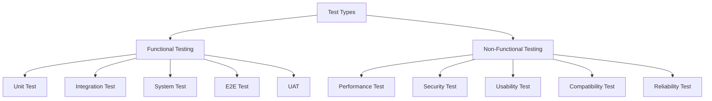
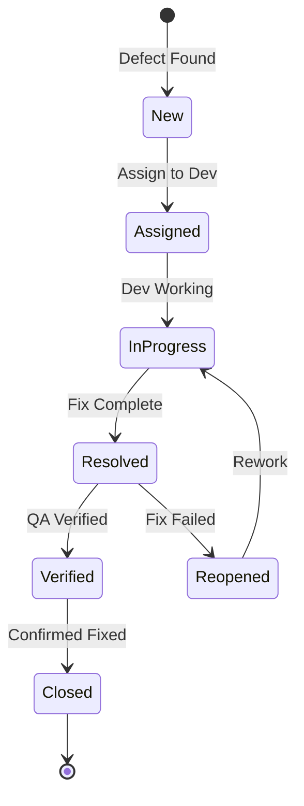

# Test Plan - Bflow Workflow Management System
**Version:** 1.0  
**Date:** 2025-07-25  
**Author:** QA/QC Lead  
**Status:** Draft

## 1. Introduction

### 1.1 Purpose
Tài liệu này định nghĩa chiến lược và kế hoạch kiểm thử toàn diện cho hệ thống Bflow Workflow Management System, bao gồm Unit Test, Integration Test, Functional Test, và End-to-End Test.

### 1.2 Scope
- **In Scope**: Tất cả các chức năng của Bflow bao gồm Workflow Configuration, Runtime Execution, Task Management, Analytics, và Integration
- **Out of Scope**: Third-party systems (chỉ test integration points)

### 1.3 Test Objectives
1. Đảm bảo chất lượng code với coverage ≥ 80%
2. Verify tất cả business requirements được implement đúng
3. Đảm bảo system performance và scalability
4. Validate security và data integrity
5. Confirm compatibility và integration

### 1.4 Test Approach
- **Test-Driven Development (TDD)** cho unit tests
- **Behavior-Driven Development (BDD)** cho functional tests
- **Continuous Integration** với automated testing
- **Risk-Based Testing** để prioritize test cases

## 2. Test Strategy

### 2.1 Test Levels

| Test Level | Coverage Target | Automation | Frequency |
|------------|-----------------|------------|-----------|
| Unit Test | 80% | 100% | Every commit |
| Integration Test | 70% | 90% | Every merge |
| Functional Test | 100% requirements | 80% | Daily |
| E2E Test | Critical paths | 70% | Before release |
| Performance Test | Key scenarios | 100% | Weekly |
| Security Test | OWASP Top 10 | 50% | Sprint end |

### 2.2 Test Types



### 2.3 Test Environment

| Environment | Purpose | Data | Access |
|-------------|---------|------|--------|
| Development | Unit & Integration tests | Mock data | Developers |
| Testing | Functional tests | Test data | QA Team |
| Staging | E2E & Performance tests | Production-like | QA + Selected users |
| Production | Smoke tests only | Real data | Limited |

## 3. Unit Test Plan

### 3.1 Unit Test Strategy
- Test individual components in isolation
- Mock external dependencies
- Focus on business logic
- Achieve minimum 80% code coverage

### 3.2 Unit Test Framework
```python
# Technology Stack
- Python: pytest, pytest-django, pytest-cov
- JavaScript: Jest, React Testing Library
- Mocking: unittest.mock, factory_boy
- Coverage: coverage.py
```

### 3.3 Unit Test Examples

#### 3.3.1 Model Unit Test
```python
# test_workflow_models.py
import pytest
from django.test import TestCase
from apps.core.workflow.models import Workflow, Node, Association
from apps.shared.test_utils import TenantTestCase

class TestWorkflowModel(TenantTestCase):
    """Test Workflow model functionality"""
    
    def setUp(self):
        super().setUp()
        self.workflow = self.create_workflow()
    
    def test_workflow_creation(self):
        """Test workflow can be created with valid data"""
        self.assertIsNotNone(self.workflow.id)
        self.assertEqual(self.workflow.name, "Test Workflow")
        self.assertEqual(self.workflow.tenant, self.tenant)
        self.assertEqual(self.workflow.company, self.company)
    
    def test_workflow_str_representation(self):
        """Test workflow string representation"""
        self.assertEqual(str(self.workflow), "Test Workflow")
    
    def test_workflow_is_valid(self):
        """Test workflow validation logic"""
        # Workflow without nodes should be invalid
        self.assertFalse(self.workflow.is_valid())
        
        # Add start and end nodes
        start_node = Node.objects.create(
            workflow=self.workflow,
            name="Start",
            action=0,
            is_initial=True
        )
        end_node = Node.objects.create(
            workflow=self.workflow,
            name="End",
            action=0,
            is_end=True
        )
        
        # Now should be valid
        self.assertTrue(self.workflow.is_valid())
    
    def test_workflow_zones_json_field(self):
        """Test zones JSON field storage"""
        zones = [
            {"id": 1, "name": "Zone 1", "is_editable": True},
            {"id": 2, "name": "Zone 2", "is_editable": False}
        ]
        self.workflow.zones = zones
        self.workflow.save()
        
        # Reload from database
        workflow = Workflow.objects.get(id=self.workflow.id)
        self.assertEqual(workflow.zones, zones)
    
    @pytest.mark.parametrize("is_multi_company,expected", [
        (True, True),
        (False, False),
    ])
    def test_workflow_multi_company_flag(self, is_multi_company, expected):
        """Test multi-company flag behavior"""
        self.workflow.is_multi_company = is_multi_company
        self.workflow.save()
        self.assertEqual(self.workflow.is_multi_company, expected)
```

#### 3.3.2 Service Unit Test
```python
# test_workflow_engine.py
import pytest
from unittest.mock import Mock, patch
from apps.core.workflow.services import WorkflowEngine
from apps.core.workflow.exceptions import WorkflowException

class TestWorkflowEngine:
    """Test WorkflowEngine service"""
    
    @pytest.fixture
    def engine(self):
        return WorkflowEngine()
    
    @pytest.fixture
    def mock_workflow(self):
        workflow = Mock()
        workflow.id = "test-workflow-id"
        workflow.is_valid.return_value = True
        return workflow
    
    def test_create_runtime_success(self, engine, mock_workflow):
        """Test successful runtime creation"""
        document = Mock(id="doc-id")
        user = Mock(id="user-id")
        
        with patch('apps.core.workflow.models.Runtime.objects.create') as mock_create:
            mock_runtime = Mock(id="runtime-id")
            mock_create.return_value = mock_runtime
            
            runtime = engine.create_runtime(mock_workflow, document, user)
            
            assert runtime.id == "runtime-id"
            mock_create.assert_called_once()
    
    def test_create_runtime_invalid_workflow(self, engine):
        """Test runtime creation with invalid workflow"""
        workflow = Mock()
        workflow.is_valid.return_value = False
        
        with pytest.raises(WorkflowException) as exc:
            engine.create_runtime(workflow, Mock(), Mock())
        
        assert "Invalid workflow configuration" in str(exc.value)
    
    def test_evaluate_condition(self, engine):
        """Test condition evaluation logic"""
        condition = {
            "field": "amount",
            "operator": "greater_than",
            "value": 1000
        }
        context = {"amount": 1500}
        
        result = engine.evaluate_condition(condition, context)
        assert result is True
        
        context["amount"] = 500
        result = engine.evaluate_condition(condition, context)
        assert result is False
    
    @pytest.mark.parametrize("operator,field_value,condition_value,expected", [
        ("equals", "approved", "approved", True),
        ("equals", "rejected", "approved", False),
        ("not_equals", "approved", "rejected", True),
        ("greater_than", 1500, 1000, True),
        ("less_than", 500, 1000, True),
        ("contains", "test string", "test", True),
        ("in_list", "option1", ["option1", "option2"], True),
    ])
    def test_condition_operators(self, engine, operator, field_value, condition_value, expected):
        """Test various condition operators"""
        condition = {
            "field": "test_field",
            "operator": operator,
            "value": condition_value
        }
        context = {"test_field": field_value}
        
        result = engine.evaluate_condition(condition, context)
        assert result == expected
```

#### 3.3.3 API View Unit Test
```python
# test_workflow_api.py
import json
from django.test import TestCase
from rest_framework.test import APIClient
from rest_framework import status
from apps.core.workflow.models import Workflow

class TestWorkflowAPI(TestCase):
    """Test Workflow API endpoints"""
    
    def setUp(self):
        self.client = APIClient()
        self.user = self.create_user()
        self.client.force_authenticate(user=self.user)
    
    def test_list_workflows(self):
        """Test GET /api/v1/workflows"""
        # Create test workflows
        Workflow.objects.create(name="Workflow 1", app=self.app)
        Workflow.objects.create(name="Workflow 2", app=self.app)
        
        response = self.client.get('/api/v1/workflows/')
        
        self.assertEqual(response.status_code, status.HTTP_200_OK)
        self.assertEqual(len(response.data['items']), 2)
    
    def test_create_workflow(self):
        """Test POST /api/v1/workflows"""
        data = {
            "name": "New Workflow",
            "app_id": str(self.app.id),
            "nodes": [
                {
                    "name": "Start",
                    "action": 0,
                    "is_initial": True
                }
            ]
        }
        
        response = self.client.post(
            '/api/v1/workflows/',
            data=json.dumps(data),
            content_type='application/json'
        )
        
        self.assertEqual(response.status_code, status.HTTP_201_CREATED)
        self.assertEqual(response.data['name'], "New Workflow")
    
    def test_create_workflow_validation(self):
        """Test workflow creation validation"""
        data = {
            "name": "",  # Empty name should fail
            "app_id": str(self.app.id)
        }
        
        response = self.client.post(
            '/api/v1/workflows/',
            data=json.dumps(data),
            content_type='application/json'
        )
        
        self.assertEqual(response.status_code, status.HTTP_422_UNPROCESSABLE_ENTITY)
        self.assertIn('name', response.data['errors'][0]['field'])
```

### 3.4 Unit Test Coverage Requirements

| Component | Minimum Coverage | Priority |
|-----------|-----------------|----------|
| Models | 90% | High |
| Services/Business Logic | 85% | High |
| API Views | 80% | Medium |
| Serializers | 75% | Medium |
| Utils/Helpers | 70% | Low |

## 4. Integration Test Plan

### 4.1 Integration Test Strategy
- Test component interactions
- Verify data flow between modules
- Test external service integrations
- Database transaction testing

### 4.2 Integration Test Examples

#### 4.2.1 Database Integration Test
```python
# test_workflow_db_integration.py
import pytest
from django.test import TransactionTestCase
from django.db import transaction
from apps.core.workflow.models import Workflow, Runtime, RuntimeStage

class TestWorkflowDatabaseIntegration(TransactionTestCase):
    """Test database transactions and relationships"""
    
    def test_workflow_cascade_delete(self):
        """Test cascade deletion of related objects"""
        workflow = Workflow.objects.create(name="Test Workflow")
        node = Node.objects.create(workflow=workflow, name="Node 1")
        
        # Create runtime
        runtime = Runtime.objects.create(workflow=workflow)
        stage = RuntimeStage.objects.create(runtime=runtime, node=node)
        
        # Delete workflow should cascade
        workflow.delete()
        
        self.assertEqual(Node.objects.count(), 0)
        self.assertEqual(Runtime.objects.count(), 0)
        self.assertEqual(RuntimeStage.objects.count(), 0)
    
    def test_transaction_rollback(self):
        """Test transaction rollback on error"""
        with pytest.raises(Exception):
            with transaction.atomic():
                workflow = Workflow.objects.create(name="Test")
                node = Node.objects.create(workflow=workflow)
                # Force an error
                raise Exception("Test error")
        
        # Nothing should be saved
        self.assertEqual(Workflow.objects.count(), 0)
        self.assertEqual(Node.objects.count(), 0)
```

#### 4.2.2 API Integration Test
```python
# test_workflow_runtime_integration.py
from django.test import TestCase
from rest_framework.test import APIClient

class TestWorkflowRuntimeIntegration(TestCase):
    """Test workflow runtime execution integration"""
    
    def test_complete_workflow_execution(self):
        """Test complete workflow execution flow"""
        # Create workflow
        workflow = self.create_workflow_with_nodes()
        
        # Create document
        document = self.create_test_document()
        
        # Start workflow
        response = self.client.post('/api/v1/runtime/execute', {
            'workflow_id': str(workflow.id),
            'document_type': 'test_document',
            'document_id': str(document.id)
        })
        
        self.assertEqual(response.status_code, 201)
        runtime_id = response.data['runtime_id']
        
        # Get tasks
        response = self.client.get('/api/v1/tasks/')
        self.assertEqual(len(response.data['items']), 1)
        
        task_id = response.data['items'][0]['id']
        
        # Perform action
        response = self.client.post(f'/api/v1/tasks/{task_id}/action', {
            'action': 'approve',
            'comments': 'Approved'
        })
        
        self.assertEqual(response.status_code, 200)
        
        # Check runtime status
        response = self.client.get(f'/api/v1/runtime/{runtime_id}')
        self.assertEqual(response.data['status'], 'completed')
```

#### 4.2.3 Message Queue Integration Test
```python
# test_celery_integration.py
import pytest
from unittest.mock import patch
from apps.core.workflow.tasks import process_workflow_stage

class TestCeleryIntegration:
    """Test Celery task integration"""
    
    @pytest.mark.celery(result_backend='redis://')
    def test_async_stage_processing(self, celery_worker):
        """Test asynchronous stage processing"""
        runtime = self.create_runtime()
        stage = self.create_stage(runtime)
        
        # Call task
        result = process_workflow_stage.delay(runtime.id, stage.id)
        
        # Wait for result
        assert result.get(timeout=10) == {
            'status': 'success',
            'stage_id': str(stage.id)
        }
        
        # Verify stage updated
        stage.refresh_from_db()
        assert stage.status == 'completed'
```

### 4.3 External Service Integration Tests

```python
# test_external_integrations.py
import responses
from django.test import TestCase

class TestExternalIntegrations(TestCase):
    """Test external service integrations"""
    
    @responses.activate
    def test_email_notification_integration(self):
        """Test email service integration"""
        # Mock email service
        responses.add(
            responses.POST,
            'https://api.sendgrid.com/v3/mail/send',
            json={'message': 'success'},
            status=202
        )
        
        # Trigger email
        task = self.create_task()
        result = send_task_notification(task)
        
        self.assertTrue(result)
        self.assertEqual(len(responses.calls), 1)
    
    @responses.activate
    def test_webhook_delivery(self):
        """Test webhook delivery integration"""
        # Mock webhook endpoint
        responses.add(
            responses.POST,
            'https://example.com/webhook',
            json={'received': True},
            status=200
        )
        
        # Create webhook
        webhook = Webhook.objects.create(
            url='https://example.com/webhook',
            events=['task.assigned']
        )
        
        # Trigger event
        trigger_webhook_event('task.assigned', {'task_id': '123'})
        
        self.assertEqual(len(responses.calls), 1)
        call = responses.calls[0]
        self.assertIn('X-Webhook-Signature', call.request.headers)
```

## 5. Functional Test Plan

### 5.1 Functional Test Strategy
- Test business requirements
- Verify user workflows
- End-user perspective testing
- Cross-browser testing

### 5.2 Functional Test Scenarios

#### 5.2.1 Workflow Configuration Tests
```gherkin
# workflow_configuration.feature
Feature: Workflow Configuration
  As a Workflow Designer
  I want to create and configure workflows
  So that business processes can be automated

  Background:
    Given I am logged in as a workflow designer
    And I am on the workflow designer page

  Scenario: Create simple approval workflow
    When I click "Create New Workflow"
    And I enter "Leave Request Approval" as workflow name
    And I drag "Start" node to canvas
    And I drag "Approval" node to canvas
    And I drag "End" node to canvas
    And I connect the nodes in sequence
    And I click "Save Workflow"
    Then I should see "Workflow created successfully"
    And the workflow should appear in my workflow list

  Scenario: Configure node properties
    Given I have a workflow with an approval node
    When I double-click the approval node
    And I set the name to "Manager Approval"
    And I select "Direct Manager" as collaborator type
    And I set SLA to "24 hours"
    And I click "Save Properties"
    Then the node should show "Manager Approval" as its label
    And the properties should be saved

  Scenario: Add conditional routing
    Given I have a workflow with multiple paths
    When I click on the connection between nodes
    And I add condition "amount > 10000"
    And I save the condition
    Then the connection should show a condition indicator
    And the workflow should route based on amount
```

#### 5.2.2 Runtime Execution Tests
```python
# test_functional_runtime.py
from selenium import webdriver
from selenium.webdriver.common.by import By
from selenium.webdriver.support.ui import WebDriverWait
from selenium.webdriver.support import expected_conditions as EC

class TestWorkflowExecution:
    """Functional tests for workflow execution"""
    
    def test_submit_leave_request(self, browser):
        """Test complete leave request workflow"""
        # Login
        browser.get(f"{BASE_URL}/login")
        browser.find_element(By.ID, "username").send_keys("employee@test.com")
        browser.find_element(By.ID, "password").send_keys("password")
        browser.find_element(By.ID, "login-btn").click()
        
        # Navigate to leave request
        browser.find_element(By.LINK_TEXT, "Leave Request").click()
        
        # Fill form
        browser.find_element(By.ID, "start_date").send_keys("2025-08-01")
        browser.find_element(By.ID, "end_date").send_keys("2025-08-05")
        browser.find_element(By.ID, "reason").send_keys("Family vacation")
        
        # Select workflow
        workflow_dropdown = browser.find_element(By.ID, "workflow")
        workflow_dropdown.select_by_visible_text("Leave Request Approval")
        
        # Submit
        browser.find_element(By.ID, "submit-btn").click()
        
        # Wait for success message
        wait = WebDriverWait(browser, 10)
        success_msg = wait.until(
            EC.presence_of_element_located((By.CLASS_NAME, "success-message"))
        )
        
        assert "submitted successfully" in success_msg.text
        
        # Verify workflow started
        browser.find_element(By.LINK_TEXT, "My Requests").click()
        request_status = browser.find_element(By.CLASS_NAME, "status-badge")
        assert request_status.text == "Pending Approval"
```

### 5.3 User Acceptance Test Scenarios

| Test ID | Scenario | Steps | Expected Result |
|---------|----------|-------|-----------------|
| UAT-001 | Manager approves leave request | 1. Login as manager<br>2. Go to My Tasks<br>3. Open leave request<br>4. Click Approve<br>5. Add comments | Request approved, employee notified |
| UAT-002 | Multi-level approval | 1. Submit high-value PO<br>2. Manager approves<br>3. Finance approves<br>4. Check status | PO approved at all levels |
| UAT-003 | Task delegation | 1. Open assigned task<br>2. Click Delegate<br>3. Select colleague<br>4. Add reason | Task reassigned successfully |
| UAT-004 | View workflow progress | 1. Open submitted request<br>2. Click View Progress<br>3. Check diagram | Current stage highlighted |
| UAT-005 | Bulk task actions | 1. Select multiple tasks<br>2. Choose bulk approve<br>3. Confirm action | All selected tasks approved |

## 6. End-to-End Test Plan

### 6.1 E2E Test Strategy
- Test complete user journeys
- Cross-system integration
- Real-world scenarios
- Production-like environment

### 6.2 Critical E2E Test Scenarios

#### 6.2.1 Leave Request E2E Flow
```javascript
// e2e/leave-request-flow.spec.js
describe('Leave Request E2E Flow', () => {
  it('should complete full leave request cycle', async () => {
    // Employee submits request
    await loginAs('employee@test.com');
    await page.goto('/leave-request/new');
    await page.fill('#start_date', '2025-08-01');
    await page.fill('#end_date', '2025-08-05');
    await page.fill('#reason', 'Annual vacation');
    await page.click('#submit');
    
    const requestId = await page.textContent('.request-id');
    
    // Manager receives notification
    await loginAs('manager@test.com');
    await page.goto('/tasks');
    await expect(page.locator('.task-count')).toHaveText('1');
    
    // Manager approves
    await page.click(`[data-request-id="${requestId}"]`);
    await page.click('#approve-btn');
    await page.fill('#comments', 'Approved. Enjoy your vacation!');
    await page.click('#confirm');
    
    // HR processes
    await loginAs('hr@test.com');
    await page.goto('/tasks');
    await page.click(`[data-request-id="${requestId}"]`);
    await page.click('#process-btn');
    
    // Employee receives confirmation
    await loginAs('employee@test.com');
    await page.goto('/my-requests');
    await expect(page.locator(`[data-request-id="${requestId}"] .status`))
      .toHaveText('Approved');
    
    // Verify in calendar
    await page.goto('/calendar');
    await expect(page.locator('[data-date="2025-08-01"]'))
      .toHaveClass('leave-day');
  });
});
```

#### 6.2.2 Purchase Order E2E Flow
```python
# e2e/test_purchase_order_flow.py
from playwright.sync_api import Page, expect

def test_purchase_order_approval_flow(page: Page):
    """Test complete PO approval flow with integration"""
    
    # Create PO in ERP
    po_data = create_purchase_order_in_erp()
    
    # Login and start workflow
    login(page, "requester@test.com")
    page.goto("/purchase-orders")
    page.click("text=Start Workflow")
    page.select("#workflow", "PO Approval Workflow")
    page.fill("#po_number", po_data["number"])
    page.click("#start-workflow")
    
    # Verify workflow started
    expect(page.locator(".alert-success")).to_contain_text("Workflow started")
    
    # Manager approval (amount < 10000)
    login(page, "manager@test.com")
    page.goto("/tasks")
    page.click(f"text={po_data['number']}")
    
    # Verify PO details from ERP
    expect(page.locator("#po-amount")).to_have_text(f"${po_data['amount']}")
    expect(page.locator("#vendor")).to_have_text(po_data["vendor"])
    
    page.click("#approve")
    page.fill("#approval-comments", "Approved within budget")
    page.click("#submit-approval")
    
    # For amount > 10000, finance approval needed
    if po_data["amount"] > 10000:
        login(page, "finance@test.com")
        page.goto("/tasks")
        page.click(f"text={po_data['number']}")
        page.click("#approve")
        page.fill("#approval-comments", "Budget verified")
        page.click("#submit-approval")
    
    # Verify PO status in ERP
    po_status = get_po_status_from_erp(po_data["number"])
    assert po_status == "APPROVED"
    
    # Verify completion
    login(page, "requester@test.com")
    page.goto("/my-requests")
    expect(page.locator(f"[data-po='{po_data['number']}'] .status")).to_have_text("Completed")
```

### 6.3 E2E Test Data Management

```python
# e2e/test_data_manager.py
class E2ETestDataManager:
    """Manage test data for E2E tests"""
    
    def __init__(self):
        self.created_entities = []
    
    def create_test_company(self):
        """Create test company with full setup"""
        company = Company.objects.create(
            name=f"E2E Test Company {uuid.uuid4()}",
            code=f"E2E_{random.randint(1000, 9999)}"
        )
        self.created_entities.append(('company', company.id))
        
        # Create departments
        departments = [
            Department.objects.create(name="Management", company=company),
            Department.objects.create(name="Finance", company=company),
            Department.objects.create(name="HR", company=company)
        ]
        
        # Create users with roles
        users = {
            'employee': self.create_user('employee', departments[0]),
            'manager': self.create_user('manager', departments[0]),
            'finance': self.create_user('finance_officer', departments[1]),
            'hr': self.create_user('hr_officer', departments[2])
        }
        
        # Create workflows
        workflows = {
            'leave': self.create_leave_workflow(company),
            'po': self.create_po_workflow(company)
        }
        
        return {
            'company': company,
            'departments': departments,
            'users': users,
            'workflows': workflows
        }
    
    def cleanup(self):
        """Clean up all created test data"""
        for entity_type, entity_id in reversed(self.created_entities):
            if entity_type == 'company':
                Company.objects.filter(id=entity_id).delete()
            # Add other entity types as needed
```

## 7. Performance Test Plan

### 7.1 Performance Test Scenarios

| Scenario | Target | Concurrent Users | Duration |
|----------|--------|------------------|----------|
| Workflow Execution | < 2s response time | 100 | 30 min |
| Task List Loading | < 1s response time | 500 | 15 min |
| Bulk Approval | Process 100 tasks < 30s | 50 | 10 min |
| Analytics Dashboard | < 3s load time | 200 | 20 min |
| API Endpoints | < 200ms response | 1000 | 60 min |

### 7.2 Performance Test Script
```python
# performance/locustfile.py
from locust import HttpUser, task, between
import random

class WorkflowUser(HttpUser):
    wait_time = between(1, 3)
    
    def on_start(self):
        """Login and get token"""
        response = self.client.post("/api/v1/auth/login", json={
            "username": f"testuser{random.randint(1, 100)}@test.com",
            "password": "password"
        })
        self.token = response.json()["access_token"]
        self.client.headers.update({"Authorization": f"Bearer {self.token}"})
    
    @task(3)
    def view_tasks(self):
        """Most common operation - view tasks"""
        self.client.get("/api/v1/tasks", name="View Tasks")
    
    @task(2)
    def view_workflow_list(self):
        """View available workflows"""
        self.client.get("/api/v1/workflows", name="List Workflows")
    
    @task(1)
    def execute_workflow(self):
        """Start new workflow"""
        self.client.post("/api/v1/runtime/execute", 
            name="Execute Workflow",
            json={
                "workflow_id": "test-workflow-id",
                "document_type": "test_doc",
                "document_id": f"doc-{random.randint(1, 10000)}"
            }
        )
    
    @task(2)
    def perform_task_action(self):
        """Approve/reject tasks"""
        task_id = f"task-{random.randint(1, 1000)}"
        self.client.post(f"/api/v1/tasks/{task_id}/action",
            name="Task Action",
            json={
                "action": random.choice(["approve", "reject"]),
                "comments": "Performance test action"
            }
        )
```

## 8. Security Test Plan

### 8.1 Security Test Checklist

| Category | Test Case | Tool | Priority |
|----------|-----------|------|----------|
| **Authentication** | Brute force protection | Hydra | High |
| | Token expiration | Manual | High |
| | Session management | OWASP ZAP | High |
| **Authorization** | Role-based access | Selenium | High |
| | Privilege escalation | Burp Suite | High |
| | Cross-tenant access | Manual | Critical |
| **Input Validation** | SQL Injection | SQLMap | High |
| | XSS | OWASP ZAP | High |
| | Command Injection | Manual | Medium |
| **Data Protection** | Encryption at rest | Manual | High |
| | Encryption in transit | Wireshark | High |
| | Sensitive data exposure | Manual | High |
| **API Security** | Rate limiting | JMeter | Medium |
| | API authentication | Postman | High |
| | CORS policy | Browser DevTools | Medium |

### 8.2 Security Test Examples
```python
# security/test_security.py
import pytest
from django.test import TestCase

class TestSecurityVulnerabilities(TestCase):
    """Test for common security vulnerabilities"""
    
    def test_sql_injection_protection(self):
        """Test SQL injection in search parameters"""
        malicious_input = "'; DROP TABLE workflow; --"
        response = self.client.get('/api/v1/workflows/', {
            'search': malicious_input
        })
        
        # Should handle safely
        self.assertEqual(response.status_code, 200)
        
        # Table should still exist
        self.assertTrue(Workflow.objects.exists())
    
    def test_xss_protection(self):
        """Test XSS in user inputs"""
        xss_payload = '<script>alert("XSS")</script>'
        
        response = self.client.post('/api/v1/workflows/', {
            'name': xss_payload,
            'description': xss_payload
        })
        
        # Check response doesn't reflect script
        self.assertNotIn('<script>', response.content.decode())
    
    def test_cross_tenant_access_denied(self):
        """Test cross-tenant data access is blocked"""
        # Create workflow in tenant A
        workflow_a = self.create_workflow(tenant=self.tenant_a)
        
        # Login as user from tenant B
        self.client.force_authenticate(user=self.user_tenant_b)
        
        # Try to access tenant A's workflow
        response = self.client.get(f'/api/v1/workflows/{workflow_a.id}/')
        
        self.assertEqual(response.status_code, 404)
    
    def test_authentication_required(self):
        """Test endpoints require authentication"""
        # Logout
        self.client.logout()
        
        endpoints = [
            '/api/v1/workflows/',
            '/api/v1/tasks/',
            '/api/v1/runtime/execute'
        ]
        
        for endpoint in endpoints:
            response = self.client.get(endpoint)
            self.assertEqual(response.status_code, 401)
```

## 9. Test Data Management

### 9.1 Test Data Strategy

| Data Type | Source | Management | Refresh Cycle |
|-----------|--------|------------|---------------|
| Master Data | Seed scripts | Version controlled | Each deployment |
| Transactional Data | Factory classes | Generated on demand | Each test run |
| User Data | LDAP mock | Centralized | Weekly |
| Integration Data | Stubs/Mocks | API mocks | As needed |

### 9.2 Test Data Factory
```python
# test_factories.py
import factory
from factory.django import DjangoModelFactory
from apps.core.workflow.models import Workflow, Node

class WorkflowFactory(DjangoModelFactory):
    class Meta:
        model = Workflow
    
    name = factory.Sequence(lambda n: f"Test Workflow {n}")
    description = factory.Faker('sentence')
    is_active = True
    is_applied = False
    
    @factory.post_generation
    def nodes(self, create, extracted, **kwargs):
        if not create:
            return
        
        if extracted:
            for node in extracted:
                self.nodes.add(node)
        else:
            # Create default nodes
            NodeFactory.create(workflow=self, is_initial=True)
            NodeFactory.create(workflow=self, name="Approval")
            NodeFactory.create(workflow=self, is_end=True)

class NodeFactory(DjangoModelFactory):
    class Meta:
        model = Node
    
    name = factory.Sequence(lambda n: f"Node {n}")
    action = factory.Faker('random_element', elements=[0, 1, 2, 3, 4, 5])
    is_initial = False
    is_end = False

class RuntimeFactory(DjangoModelFactory):
    class Meta:
        model = Runtime
    
    workflow = factory.SubFactory(WorkflowFactory)
    status = 'in_progress'
    model_name = 'test_document'
    object_id = factory.Faker('uuid4')
```

## 10. Test Automation Framework

### 10.1 Framework Architecture
```yaml
test-automation/
├── unit/                 # Unit tests
│   ├── models/
│   ├── services/
│   └── api/
├── integration/         # Integration tests
│   ├── database/
│   ├── api/
│   └── external/
├── functional/          # Functional tests
│   ├── features/        # Gherkin files
│   ├── steps/          # Step definitions
│   └── pages/          # Page objects
├── e2e/                # End-to-end tests
│   ├── scenarios/
│   └── data/
├── performance/        # Performance tests
│   └── locust/
├── security/           # Security tests
│   └── owasp/
├── fixtures/           # Test data
├── utils/              # Test utilities
└── reports/            # Test reports
```

### 10.2 CI/CD Integration
```yaml
# .gitlab-ci.yml
stages:
  - test
  - security
  - performance
  - report

unit-tests:
  stage: test
  script:
    - pytest tests/unit --cov=apps --cov-report=xml
    - coverage report --fail-under=80
  artifacts:
    reports:
      coverage_report:
        coverage_format: cobertura
        path: coverage.xml

integration-tests:
  stage: test
  services:
    - mysql:8.0
    - redis:latest
    - rabbitmq:latest
  script:
    - pytest tests/integration -v
  
functional-tests:
  stage: test
  services:
    - selenium/standalone-chrome:latest
  script:
    - pytest tests/functional --html=report.html
  artifacts:
    paths:
      - report.html

security-scan:
  stage: security
  script:
    - python manage.py check --deploy
    - safety check
    - bandit -r apps/
    - python -m pytest tests/security

performance-tests:
  stage: performance
  script:
    - locust -f tests/performance/locustfile.py --headless -u 100 -r 10 -t 5m
  only:
    - develop
    - master

test-report:
  stage: report
  script:
    - python scripts/generate_test_report.py
  artifacts:
    reports:
      junit: test-results.xml
```

## 11. Test Execution Schedule

| Test Type | Trigger | Frequency | Duration | Environment |
|-----------|---------|-----------|----------|-------------|
| Unit Tests | Every commit | Continuous | 5 min | CI |
| Integration Tests | Every PR | Continuous | 15 min | CI |
| Functional Tests | Merge to develop | Daily | 30 min | Test |
| E2E Tests | Before release | Weekly | 2 hours | Staging |
| Performance Tests | Scheduled | Weekly | 1 hour | Performance |
| Security Tests | Scheduled | Bi-weekly | 4 hours | Security |
| Full Regression | Release candidate | Per release | 6 hours | Staging |

## 12. Defect Management

### 12.1 Defect Severity Levels

| Severity | Description | Response Time | Example |
|----------|-------------|---------------|---------|
| Critical | System down, data loss | 2 hours | Workflow engine crash |
| High | Major function broken | 4 hours | Cannot approve tasks |
| Medium | Function impaired | 1 day | UI rendering issues |
| Low | Minor issue | 3 days | Typo in message |

### 12.2 Defect Lifecycle


## 13. Test Metrics & KPIs

### 13.1 Key Metrics

| Metric | Target | Formula | Frequency |
|--------|--------|---------|-----------|
| Test Coverage | ≥ 80% | (Covered Lines / Total Lines) × 100 | Daily |
| Test Pass Rate | ≥ 95% | (Passed Tests / Total Tests) × 100 | Per Run |
| Defect Density | < 5/KLOC | Defects / KLOC | Sprint |
| Defect Escape Rate | < 5% | (Prod Defects / Total Defects) × 100 | Release |
| Test Execution Time | < 2 hours | Sum of all test durations | Daily |
| Automation Rate | > 80% | (Automated / Total Tests) × 100 | Monthly |

### 13.2 Test Dashboard
```python
# metrics/test_metrics.py
class TestMetricsCollector:
    """Collect and report test metrics"""
    
    def generate_dashboard_data(self):
        return {
            'coverage': self.get_coverage_metrics(),
            'test_results': self.get_test_results(),
            'defects': self.get_defect_metrics(),
            'trends': self.get_trend_data()
        }
    
    def get_coverage_metrics(self):
        return {
            'line_coverage': 82.5,
            'branch_coverage': 78.3,
            'by_module': {
                'workflow': 85.2,
                'runtime': 79.8,
                'api': 83.1
            }
        }
```

## 14. Risk Mitigation

### 14.1 Testing Risks

| Risk | Impact | Probability | Mitigation |
|------|--------|-------------|------------|
| Incomplete test coverage | High | Medium | Enforce coverage gates in CI |
| Test environment instability | High | Low | Containerized environments |
| Test data corruption | Medium | Low | Isolated test databases |
| Long test execution | Medium | High | Parallel execution, test optimization |
| Flaky tests | Medium | Medium | Test retry mechanism, investigation |

## 15. Test Sign-off Criteria

### 15.1 Release Criteria
- [ ] All unit tests passing (100%)
- [ ] Code coverage ≥ 80%
- [ ] All integration tests passing
- [ ] All critical E2E scenarios passing
- [ ] No critical or high severity defects
- [ ] Performance benchmarks met
- [ ] Security scan passed
- [ ] UAT sign-off received

### 15.2 Sprint Exit Criteria
- [ ] All planned user stories tested
- [ ] Test pass rate ≥ 95%
- [ ] No open critical defects
- [ ] Test report published
- [ ] Regression suite updated

---
**Document Control:**
- Version: 1.0
- Last Updated: 2025-07-25
- Review Cycle: Every Sprint
- Approval: QA Lead, Tech Lead, Product Owner