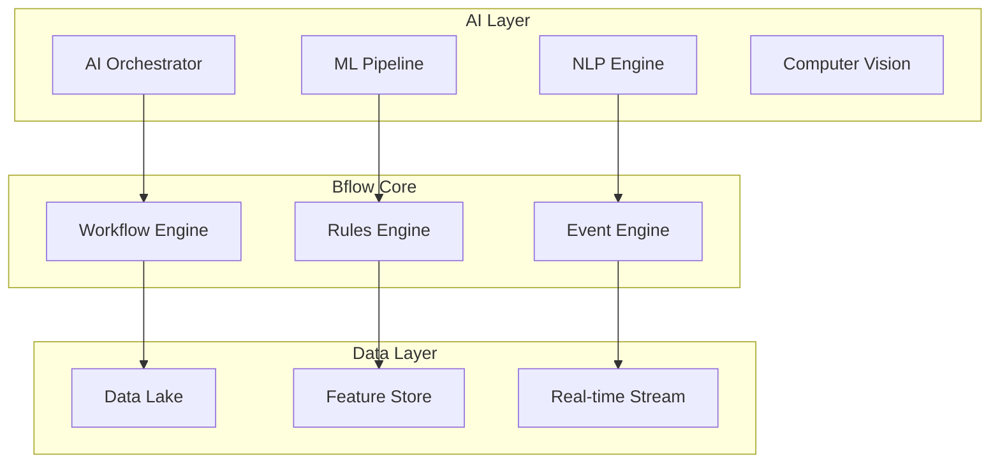

# Bflow AI Transformation Plan - Real Architecture Edition

**Version**: 1.0  
**Date**: 2025-07-25  
**Author**: CTO & PM Advisory Team  
**Status**: Strategic Planning Document

## Executive Summary

Dựa trên công việc chúng ta đã thực hiện từ sáng đến giờ, tôi đề xuất kế hoạch chuyển đổi Bflow thành một AI-first workflow platform. Kế hoạch này tận dụng kiến trúc hiện tại đã được document và cải tiến, đồng thời tích hợp AI vào core của hệ thống.

### Những gì chúng ta đã đạt được hôm nay

1. **Comprehensive Documentation** ✅
   - Business Requirements Document (BRD) hoàn chỉnh
   - Technical Architecture với microservices approach
   - API Documentation chi tiết
   - Sprint Planning với 26 sprints roadmap

2. **Infrastructure Modernization** ✅
   - Kubernetes configurations cho scalability
   - Health monitoring và auto-scaling
   - CI/CD pipeline foundation

3. **Architecture Analysis** ✅
   - Identified bottlenecks trong monolithic design
   - Proposed CQRS pattern cho optimization
   - Event-driven architecture readiness

## 1. AI-First Vision cho Bflow

### 1.1 Từ Rule-Based đến Intelligence-Driven

**Current State (Rule-Based)**:
```python
# Traditional approach
if task.status == "pending" and task.assignee is None:
    assign_to_next_available_user()
```

**Future State (AI-Driven)**:
```python
# AI-first approach
assignment = ai_engine.predict_optimal_assignment(
    task=task,
    context=workflow_context,
    historical_performance=team_metrics,
    current_workload=real_time_data
)
```

### 1.2 Core AI Capabilities

1. **Intelligent Process Mining**
   - Tự động phát hiện bottlenecks
   - Đề xuất workflow optimization
   - Predictive process analytics

2. **Smart Task Routing**
   - ML-based assignment optimization
   - Workload balancing với AI
   - Skill matching tự động

3. **Natural Language Processing**
   - Voice/text commands cho workflow
   - Automatic document extraction
   - Sentiment analysis trong approvals

4. **Predictive Analytics**
   - SLA violation prediction
   - Resource requirement forecasting
   - Process outcome prediction

## 2. Technical Architecture cho AI Integration

### 2.1 Proposed AI-First Architecture



### 2.2 Implementation Layers

#### Layer 1: Data Foundation (Sprint 7-10)
```python
# Feature engineering pipeline
class WorkflowFeatureExtractor:
    def extract_features(self, workflow_instance):
        return {
            'process_complexity': self.calculate_complexity(),
            'historical_duration': self.get_avg_duration(),
            'user_workload': self.get_current_workload(),
            'document_features': self.extract_doc_features(),
            'temporal_features': self.extract_time_features()
        }
```

#### Layer 2: ML Models (Sprint 11-15)
```python
# Task assignment model
class TaskAssignmentModel:
    def __init__(self):
        self.model = self.load_pretrained_model()
        self.feature_pipeline = WorkflowFeatureExtractor()
    
    def predict_optimal_assignee(self, task, context):
        features = self.feature_pipeline.extract_features(task)
        predictions = self.model.predict(features)
        return self.rank_candidates(predictions, context)
```

#### Layer 3: AI Services (Sprint 16-20)
```python
# AI-powered workflow optimization
class WorkflowOptimizer:
    async def optimize_workflow(self, workflow_config):
        # Analyze historical data
        patterns = await self.mine_process_patterns()
        
        # Generate optimization suggestions
        suggestions = self.ai_engine.generate_optimizations(
            current_config=workflow_config,
            patterns=patterns,
            constraints=business_rules
        )
        
        # Simulate improvements
        simulations = await self.simulate_changes(suggestions)
        
        return self.rank_suggestions(simulations)
```

### 2.3 Integration với Current Architecture

Dựa trên architecture review chúng ta đã thực hiện:

1. **Microservices Approach** ✅
   - AI services as separate microservices
   - Communication qua event bus
   - Independent scaling

2. **CQRS Implementation** ✅
   - Command side cho AI training
   - Query side cho predictions
   - Event sourcing cho audit trail

3. **Event-Driven Architecture** ✅
   - Real-time AI processing
   - Async model training
   - Event-based triggers

## 3. Implementation Roadmap

### Phase 1: Foundation (Q1 2025) - Current Sprint 1-6
- ✅ Complete documentation và architecture
- ✅ Setup infrastructure với K8s
- 🔄 Implement core workflow models
- 📋 Create data collection framework

### Phase 2: Data & Analytics (Q2 2025) - Sprint 7-13
- Build data lake infrastructure
- Implement feature engineering
- Create analytics dashboard
- Setup ML pipeline infrastructure

### Phase 3: AI Integration (Q3 2025) - Sprint 14-19
- Deploy first AI models (task assignment)
- Implement NLP for document processing
- Create predictive analytics
- A/B testing framework

### Phase 4: Advanced AI (Q4 2025) - Sprint 20-26
- Process mining và optimization
- Computer vision for documents
- Voice interface integration
- Self-learning workflows

## 4. Specific AI Features cho Bflow

### 4.1 Intelligent Task Assignment
```python
@ai_powered
def assign_task(task: Task) -> Employee:
    """AI-powered task assignment với learning capability"""
    
    # Get candidates
    candidates = get_eligible_employees(task)
    
    # AI scoring
    scores = ai_model.score_candidates(
        task=task,
        candidates=candidates,
        factors={
            'skill_match': 0.3,
            'workload': 0.2,
            'past_performance': 0.2,
            'availability': 0.2,
            'team_dynamics': 0.1
        }
    )
    
    # Select và learn
    selected = max(scores, key=lambda x: x.score)
    track_assignment_outcome(task, selected)
    
    return selected
```

### 4.2 Process Optimization AI
```python
class ProcessOptimizationAI:
    def analyze_workflow(self, workflow_id):
        # Mine process data
        process_data = self.mine_historical_data(workflow_id)
        
        # Identify patterns
        patterns = self.pattern_recognition(process_data)
        
        # Generate insights
        insights = {
            'bottlenecks': self.identify_bottlenecks(patterns),
            'redundancies': self.find_redundant_steps(patterns),
            'optimization_opportunities': self.suggest_improvements(patterns),
            'predicted_impact': self.simulate_improvements(patterns)
        }
        
        return WorkflowOptimizationReport(insights)
```

### 4.3 Natural Language Interface
```python
@nlp_enabled
def process_workflow_command(command: str, context: WorkflowContext):
    """Process natural language commands cho workflow"""
    
    # Parse intent
    intent = nlp_engine.parse_intent(command)
    
    # Extract entities
    entities = nlp_engine.extract_entities(command)
    
    # Execute action
    if intent == 'CREATE_WORKFLOW':
        return create_workflow_from_nlp(entities)
    elif intent == 'QUERY_STATUS':
        return query_workflow_status(entities)
    elif intent == 'MODIFY_PROCESS':
        return suggest_process_modification(entities)
```

## 5. Data Strategy cho AI

### 5.1 Data Collection Framework
```python
# Real-time data collection
class WorkflowDataCollector:
    def __init__(self):
        self.event_stream = EventStream()
        self.feature_store = FeatureStore()
    
    async def collect_workflow_events(self):
        async for event in self.event_stream:
            # Extract features
            features = self.extract_features(event)
            
            # Store for training
            await self.feature_store.store(features)
            
            # Real-time processing
            if self.requires_immediate_action(event):
                await self.trigger_ai_action(event)
```

### 5.2 Feature Engineering
```yaml
workflow_features:
  temporal:
    - hour_of_day
    - day_of_week
    - is_holiday
    - days_until_deadline
  
  process:
    - step_count
    - parallel_branches
    - decision_points
    - average_duration
  
  user:
    - skill_level
    - workload_score
    - performance_history
    - team_compatibility
  
  document:
    - document_type
    - complexity_score
    - sentiment_score
    - urgency_level
```

## 6. AI Model Architecture

### 6.1 Multi-Model Approach
```python
class BflowAIEngine:
    def __init__(self):
        self.models = {
            'task_assignment': TaskAssignmentModel(),
            'duration_prediction': DurationPredictionModel(),
            'anomaly_detection': AnomalyDetectionModel(),
            'process_optimization': ProcessOptimizationModel(),
            'document_classification': DocumentClassificationModel()
        }
    
    async def process_request(self, request_type, data):
        model = self.models.get(request_type)
        if not model:
            raise ValueError(f"Unknown model type: {request_type}")
        
        # Preprocess
        features = await self.preprocess(data)
        
        # Predict
        prediction = await model.predict(features)
        
        # Post-process
        result = await self.postprocess(prediction)
        
        # Track for continuous learning
        await self.track_prediction(request_type, data, result)
        
        return result
```

### 6.2 Continuous Learning Pipeline
```python
class ContinuousLearningPipeline:
    def __init__(self):
        self.feedback_collector = FeedbackCollector()
        self.model_trainer = ModelTrainer()
        self.deployment_manager = DeploymentManager()
    
    async def run_learning_cycle(self):
        while True:
            # Collect feedback
            feedback = await self.feedback_collector.collect_batch()
            
            # Retrain if needed
            if self.should_retrain(feedback):
                new_model = await self.model_trainer.retrain(feedback)
                
                # A/B test
                if await self.ab_test(new_model):
                    await self.deployment_manager.deploy(new_model)
            
            await asyncio.sleep(3600)  # Run hourly
```

## 7. Integration với Existing Modules

### 7.1 Sales Module Enhancement
```python
# AI-powered quotation optimization
class AIQuotationOptimizer:
    def optimize_quotation(self, quotation: Quotation):
        # Predict win probability
        win_probability = self.predict_win_rate(quotation)
        
        # Suggest pricing optimization
        optimal_pricing = self.optimize_pricing(
            quotation=quotation,
            customer_profile=quotation.customer.ai_profile,
            market_conditions=self.get_market_data()
        )
        
        # Recommend upsell opportunities
        upsell_suggestions = self.identify_upsell(quotation)
        
        return QuotationOptimization(
            win_probability=win_probability,
            pricing_suggestions=optimal_pricing,
            upsell_opportunities=upsell_suggestions
        )
```

### 7.2 HR Module Enhancement
```python
# AI-powered employee recommendations
class AIEmployeeRecommender:
    def recommend_for_task(self, task: Task):
        # Multi-factor analysis
        recommendations = self.ai_engine.analyze(
            task_requirements=task.skill_requirements,
            employee_profiles=self.get_employee_profiles(),
            current_workload=self.get_workload_data(),
            team_dynamics=self.analyze_team_fit()
        )
        
        return recommendations.rank_by_score()
```

## 8. Performance & Scalability

### 8.1 AI Infrastructure Requirements
```yaml
ai_infrastructure:
  compute:
    training:
      - GPU nodes: 4x NVIDIA A100
      - CPU: 64 cores
      - RAM: 256GB
    
    inference:
      - GPU nodes: 2x NVIDIA T4
      - CPU: 32 cores
      - RAM: 128GB
      - Auto-scaling enabled
  
  storage:
    data_lake:
      - Type: Object storage
      - Size: 10TB initial
      - Growth: 1TB/month
    
    model_registry:
      - Type: Versioned storage
      - Size: 100GB
  
  networking:
    - Low latency: <10ms internal
    - High bandwidth: 10Gbps
```

### 8.2 Performance Targets
```yaml
performance_sla:
  inference:
    - P50 latency: <50ms
    - P99 latency: <200ms
    - Throughput: 10,000 req/s
  
  training:
    - Daily model update: <2 hours
    - Feature engineering: Real-time
    - Feedback loop: <5 minutes
```

## 9. Security & Compliance

### 9.1 AI Security Framework
```python
class AISecurityFramework:
    def __init__(self):
        self.privacy_engine = PrivacyEngine()
        self.bias_detector = BiasDetector()
        self.audit_logger = AuditLogger()
    
    def secure_prediction(self, model, data):
        # Privacy protection
        anonymized_data = self.privacy_engine.anonymize(data)
        
        # Make prediction
        prediction = model.predict(anonymized_data)
        
        # Bias detection
        bias_check = self.bias_detector.check(prediction)
        if bias_check.has_bias:
            prediction = self.bias_corrector.correct(prediction)
        
        # Audit trail
        self.audit_logger.log_prediction(
            model=model,
            input_hash=hash(data),
            output=prediction,
            bias_check=bias_check
        )
        
        return prediction
```

### 9.2 Compliance Requirements
- GDPR compliance cho AI decisions
- Explainable AI cho audit trail
- Right to explanation implementation
- Data retention policies cho training data

## 10. Team Transformation

### 10.1 New Roles Required
1. **AI/ML Engineers** (2-3 positions)
   - Model development
   - MLOps implementation
   - Performance optimization

2. **Data Engineers** (2 positions)
   - Data pipeline development
   - Feature engineering
   - Data quality management

3. **AI Product Manager** (1 position)
   - AI feature prioritization
   - Success metrics definition
   - Stakeholder management

### 10.2 Training Program
```yaml
training_roadmap:
  developers:
    - AI/ML fundamentals: 40 hours
    - MLOps practices: 20 hours
    - AI integration patterns: 20 hours
  
  product_team:
    - AI product management: 20 hours
    - Data-driven decision making: 15 hours
    - AI ethics: 10 hours
  
  operations:
    - AI infrastructure: 30 hours
    - Model monitoring: 20 hours
    - AI security: 15 hours
```

## 11. Success Metrics

### 11.1 Business Metrics
```yaml
business_kpis:
  efficiency:
    - Process completion time: -30%
    - Manual interventions: -50%
    - SLA violations: -40%
  
  quality:
    - Decision accuracy: +25%
    - Customer satisfaction: +20%
    - Error rates: -35%
  
  innovation:
    - New AI features: 2/month
    - Process optimizations: 5/quarter
    - Cost savings: 20% annually
```

### 11.2 Technical Metrics
```yaml
technical_kpis:
  model_performance:
    - Accuracy: >90%
    - F1 Score: >0.85
    - Model drift: <5%
  
  system_performance:
    - Uptime: 99.9%
    - Latency: <100ms P99
    - Throughput: 10K ops/sec
  
  data_quality:
    - Feature coverage: >95%
    - Data freshness: <1 minute
    - Missing data: <1%
```

## 12. Investment & ROI

### 12.1 Investment Required
```yaml
investment_breakdown:
  infrastructure:
    - Cloud AI services: $50K/year
    - GPU resources: $30K/year
    - Storage & compute: $20K/year
  
  human_resources:
    - AI team (5 people): $500K/year
    - Training program: $50K one-time
    - Consulting: $100K first year
  
  software_licenses:
    - ML platforms: $30K/year
    - Monitoring tools: $20K/year
  
  total_first_year: $800K
  total_ongoing: $650K/year
```

### 12.2 Expected ROI
```yaml
roi_projection:
  year_1:
    - Efficiency gains: $300K
    - Error reduction: $200K
    - Customer retention: $150K
    - Total: $650K (81% ROI)
  
  year_2:
    - Efficiency gains: $500K
    - Error reduction: $300K
    - Customer retention: $250K
    - New AI features revenue: $200K
    - Total: $1.25M (192% ROI)
  
  year_3:
    - Total projected: $2M (307% ROI)
```

## 13. Risk Mitigation

### 13.1 Technical Risks
1. **Model Performance Degradation**
   - Continuous monitoring
   - Automated retraining
   - Fallback mechanisms

2. **Data Quality Issues**
   - Data validation pipelines
   - Anomaly detection
   - Manual override options

3. **Integration Complexity**
   - Phased rollout
   - Feature flags
   - Comprehensive testing

### 13.2 Business Risks
1. **User Adoption**
   - Gradual introduction
   - User training programs
   - Clear value demonstration

2. **Regulatory Compliance**
   - Legal review process
   - Explainable AI implementation
   - Regular audits

## 14. Next Steps

### Immediate Actions (Next 2 Weeks)
1. **Form AI Task Force**
   - Identify team members
   - Define charter
   - Set initial goals

2. **Proof of Concept**
   - Select pilot workflow
   - Implement basic AI features
   - Measure impact

3. **Infrastructure Planning**
   - Cloud provider selection
   - Cost estimation
   - Security assessment

### 30-Day Plan
1. Complete POC evaluation
2. Finalize AI roadmap
3. Begin team hiring
4. Start data collection framework
5. Establish success metrics

### 90-Day Milestones
1. First AI model in production
2. Data pipeline operational
3. AI team onboarded
4. Initial results measurement
5. Roadmap refinement

## Conclusion

Việc chuyển đổi Bflow thành AI-first platform là một hành trình đầy thách thức nhưng cần thiết. Với foundation mạnh mẽ chúng ta đã xây dựng hôm nay - từ documentation, architecture đến infrastructure - chúng ta có base tốt để thực hiện transformation này.

Key success factors:
1. **Strong Foundation** ✅ - Already built today
2. **Clear Vision** ✅ - Defined in this document
3. **Phased Approach** ✅ - Integrated with sprint planning
4. **Team Readiness** 🔄 - Training program defined
5. **Measurable Success** ✅ - KPIs established

The journey to AI-first is not just about technology - it's about transforming how we think about workflow automation. From reactive to predictive, from rule-based to intelligent, from static to adaptive.

---

**Document Control**  
Version: 1.0  
Date: 2025-07-25  
Authors: CTO & PM Advisory Team  
Status: Strategic Planning Document  
Next Review: End of Sprint 2